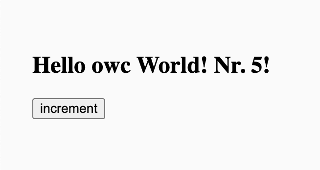

So, you write web components and you're interested in expanding the work you put into unit testing them? Well, you've come to the right place. This is just the beginning, but _Testing Web Components: the Series_ is going to lay out for you how [Open Web Components](https://open-wc.org/) and [Modern Web](https://modern-web.dev/) help you to do just that. We'll start with how the Open Web Components [generator](https://open-wc.org/guides/developing-components/getting-started/) can get you up and running in no time with [`@web/test/runner`](https://modern-web.dev/docs/test-runner/overview/) right out of the box.

While the component and tests that come with the generator are a great place to get started, in future posts we'll dig even deeper into what it means to test your web components in real browsers. Along the way we'll focus on a number of realities around unit testing web interfaces, like:

- the capabilities (and limitations) of testing UI from the JS thread
- how you can test more like a user will consumer your component, whether that's with a mouse, a keyboard, or a little slower the normal JS execution time
- what sort of accessibility guarantees you can test at unit time
- and more...

## Before we get started

To prepare for, let's take a look at the component that comes with the Open Web Components generator and the tests that are already written for it. To get started run `npm init @open-wc@latest` in your terminal. _Be aware that `npm init` has a pretty sticky cache. If you've run the command before, the inclusion of `@latest` will ensure you get the most current output._ We'll be **scaffolding a new project**, in which we will build a **web component**, to which we'll want to add **testing**, all of which we'll do in **Typescript**, and will call our component `testing-components`. If you give the generator permission to write this content to disk and install dependencies with NPM, the terminal output should look like the following:

```bash
npm init @open-wc@latest
Need to install the following packages:
  @open-wc/create@0.38.69
Ok to proceed? (y) y

        _.,,,,,,,,,._
     .d''           ``b.       Open Web Components Recommendations
   .p'      Open       `q.
 .d'    Web Components  `b.    Start or upgrade your web component project with
 .d'                     `b.   ease. All our recommendations at your fingertips.
 ::   .................   ::
 `p.                     .q'
  `p.    open-wc.org    .q'
   `b.     @openWc     .d'
     `q..            ..,'      See more details at https://open-wc.org/init/
        '',,,,,,,,,,''


Note: you can exit any time with Ctrl+C or Esc
✔ What would you like to do today? › Scaffold a new project
✔ What would you like to scaffold? › Web Component
✔ What would you like to add? › Testing (web-test-runner)
✔ Would you like to use typescript? › Yes
✔ What is the tag name of your web component? … testing-components

./
├── testing-components/
│   ├── .vscode/
│   │   └── extensions.json
│   ├── demo/
│   │   └── index.html
│   ├── src/
│   │   ├── index.ts
│   │   ├── testing-components.ts
│   │   └── TestingComponents.ts
│   ├── test/
│   │   └── testing-components.test.ts
│   ├── .editorconfig
│   ├── .gitignore
│   ├── LICENSE
│   ├── package.json
│   ├── README.md
│   ├── tsconfig.json
│   ├── web-dev-server.config.mjs
│   └── web-test-runner.config.mjs

✔ Do you want to write this file structure to disk? › Yes
Writing..... done
✔ Do you want to install dependencies? › Yes, with npm
```

Now, if you run `cd testing-components` to get into the generated project, and open the directory in your editor of choice, we'll dive into what's been created for you.

## The generated project

The first thing you'll notice are the choices from the Open Web Components generator that we didn't adopt; Linting (eslint & prettier) and Demoing (Storybook). As they aren't specifically germane to actually testing our web component, I've left them out of the repo as generated for this article, but that doesn't mean you have to do so. Whether you chose to include them now, or you choose to "Upgrade an existing project" later, these things won't specifically get in the way, but in a world where everything happens 90 miles a minute, it can be useful to start with some focus.

Then, you'll see what we did include:

- the `demo` directory holds a very simple `index.html` that is served by `@web/dev-server` via the `npm start` command, if you'd like to check out the web component that comes stock with the generator in action
- the `dist` directory holds the JS output from running `tsc` against our Typescript source, this command is include before almost all other scripts you may choose to run, so you shouldn't ever need to do so directly
- the `src` directory hold our web component which is broken into an `index.js` re-exporting the class definition exported from `TestingComponents.ts` as well as `testing-components.ts` that specifically registers that same class as the `testing-component` custom element name
- the `test` directory with one test file, `testing-components.test.ts`, that can be run via the `npm test` command

Don't let me stop you, now. I know you want to see for yourself, "will it blend?". Give `npm start` a run... you'll get something like:

<figure>



<figcaption>The initial output of our `<testing-components>` element, saying "Hello owc World! Nr. 5!" with a button that says "Increment"</figcaption>
</figure>

You can also give the tests a blend with the `npm test` command. All things having gone as planned the output should be:

```bash
npm test

> testing-components@0.0.0 test
> tsc && wtr --coverage


dist/test/testing-components.test.js:

 🚧 Browser logs:
      Lit is in dev mode. Not recommended for production! See https://lit.dev/msg/dev-mode for more information.

Chrome: |██████████████████████████████| 1/1 test files | 4 passed, 0 failed

Code coverage: 100 %
View full coverage report at coverage/lcov-report/index.html

Finished running tests in 9s, all tests passed! 🎉
```

So, we've got a pretty minimal web component and four passing tests. Let's dig in a little further to see what have we gotten for a trouble and what is actually under test by default here.

## The `<testing-components>` element

There's not much to our `<testing-component>` element, but here it is in all of its glory:

```ts
import { html, css, LitElement } from 'lit';
import { property } from 'lit/decorators.js';

export class TestingComponents extends LitElement {
  static styles = css`
    :host {
      display: block;
      padding: 25px;
      color: var(--testing-components-text-color, #000);
    }
  `;

  @property({ type: String }) title = 'Hey there';

  @property({ type: Number }) counter = 5;

  __increment() {
    this.counter += 1;
  }

  render() {
    return html`
      <h2>${this.title} Nr. ${this.counter}!</h2>
      <button @click=${this.__increment}>increment</button>
    `;
  }
}
```

The generated Typescript above heavily relies on [Lit](https://lit.dev/) to keep your web component both fast and simple. Here are some important facts to take away from this code in regards to the tests we'll investigate next:

- the class definition leverages the [`LitElement`](https://lit.dev/docs/api/LitElement/) base class, so check out [lit.dev](https://lit.dev) for more information about what that means when we get to adding new functionality in later installments
- the [`property` decorator](https://lit.dev/docs/api/decorators/#property) it being leveraged to upgrade a couple of properties to being both reactive and bound to attributes on the element
- the [`html` template literal](https://lit.dev/docs/templates/overview/) from is being leveraged to performantly render out template
- the [`@` sigil](https://lit.dev/docs/components/events/#listening-to-events) is being leveraged to declaratively listen to events on elements within out template

## The tests

In our tests, a web component defined by our `TestingComponents` class is ensured to have the following characteristics:

1. it has a default title "Hey there" and counter 5
2. it increases the counter on button click
3. it can override the title via attribute
4. it asses the a11y audit

Defaults, interactivity, customization, and accessibility, these form a great baseline for testing most web UI, so let's look closer at how this is done for our `&lt;testing-components&gt;` element, and what else might be useful in these areas.

### Defaults

As we saw above, the `@property` decorator is being leveraged to create reactive properties on our class definition. `title` is being decorated with `type: string` meaning when its value is accepted from the attribute `title` the value will be coerced to a string. Similarly, the `counter` is decorated with `type: number`, which means values applied to the `counter` attribute will be coerced to a number. A handful of these conversions are handled out of the box by Lit, but in case you have something more complex in mind, learn about [custom converters](https://lit.dev/docs/components/properties/#conversion-converter) to solve those use cases.

Numbers and strings being pretty de rigueur, the following test confirms that those values are actually applied to the custom element when attached to the DOM:

```ts
it('has a default title "Hey there" and counter 5', async () => {
  const el = await fixture<TestingComponents>(html`<testing-components></testing-components>`);

  expect(el.title).to.equal('Hey there');
  expect(el.counter).to.equal(5);
});
```

Testing that a property equals its default value by default may feel a bit superfluous, but it ensures the baseline of your web component before you dig into anything else. Testing that a property equals a property may also look a little underwhelming, it doesn't actually test anything about the property, and you may be right. Depending on what such a property does in a more _complete_ web component, it may be advantageous to confirm that those properties appear appropriately in a [DOM snapshot](https://modern-web.dev/docs/test-runner/commands/#snapshots) or in a [visual regression test](https://github.com/modernweb-dev/web/tree/master/packages/test-runner-visual-regression#test-runner-visual-regression). We'll get into these techniques, and more, in future installments.

### Interactivity

When testing web UI it is important to think of your test inputs as a future visitor interacting with your web component or a future developer building with your web component. A visitor can interact with your code in a number of ways, including a [mouse](https://modern-web.dev/docs/test-runner/commands/#send-mouse) and a [keyboard](https://modern-web.dev/docs/test-runner/commands/#send-keys), and `@web/test-runner` offers some powerful ways to emulate those interactions that we will investigate, later. This generated test acts as a developer building with your web component; leveraging the fact that `@web/test-runner` exists on the JS thread of an actual browser to leverage element APIs like `querySelector()` and `click()` within your test code:

```ts
it('increases the counter on button click', async () => {
  const el = await fixture<TestingComponents>(html`<testing-components></testing-components>`);
  el.shadowRoot!.querySelector('button')!.click();

  expect(el.counter).to.equal(6);
});
```

If you're wondering why someone building with your web component might reach into your element and manually `click()` something within your element, you're probably not the only one. However, at test time, doing this can sometimes be the only way to initiate interactions from the JS context. Other times, it can be a clear sign the the API of your element hasn't fully considered the requirements of its public interface.

Is clicking this button something that a consuming application should be able to do without human intervention? The answer may be "no", as is the case in the generated code, but, if the answer is "yes", you may want to refactor your element to prevent consuming developers from having to reach into your web component in this way. Understanding the various techniques of testing a web component can help surface these questions, and their answers before your code ships to consumers.

### Customization

By using the `property` decorator in our class definition we not only upgraded those properties to be reactive, we bound those properties to attributes on our custom element. In this way, both `title` and `counter` can be supplied new values via the attributes of the same name. The following test ensures that this relationship is maintained for the `title` attribute/property:

```ts
it('can override the title via attribute', async () => {
  const el = await fixture<TestingComponents>(
    html`<testing-components title="attribute title"></testing-components>`,
  );

  expect(el.title).to.equal('attribute title');
});
```

If you are one for being "complete", the same could be done for `counter` as well. This test specifically leverages the `html` template literal to create an instance of the `<testing-components>` element and applies the value `attribute title` as an attribute to that element. You could similarly apply that attribute manually by leveraging the element reference maintained in the `el` variable; this would be the equivalent imperative operation `el.setAttribute('title', 'attribute title');`, if you were one for being "complete"...

### Accessibility (a11y)

Not only does the Open Web Components project provide the generator that we are basing our web component on in this conversations, but they also vend [Chai A11y aXe](https://open-wc.org/docs/testing/chai-a11y-axe/) which binds [`axe-core`](https://github.com/dequelabs/axe-core) with [Chai](https://www.chaijs.com/) assertions for easy consumption in the `@web/test-runner` environment. This means that you can use the industry standard accessibility testing engine to confirm the the accessibility of you web component at unit test time. This looks like the following:

```ts
it('passes the a11y audit', async () => {
  const el = await fixture<TestingComponents>(html`<testing-components></testing-components>`);

  await expect(el).shadowDom.to.be.accessible();
});
```

**Important note:** `expect().to.be.accessible()` is an asynchronous command. If you do not `await` it you will get false positives in your test results.

But, when you do `await` it, ensuring the snapshot accessibility of your custom element is just that simple. I saw "snapshot" here in that `.accessible()` knows nothing about your web component other than the state from which you called it. That means if further interactions with the element change the accessibility model, you should be sure to add a test or tests that takes your web component into that state and confirms its accessibility in that context. In future articles, we'll take a close look at what that means, a well as the difference between a component possessing an accessible tree of DOM nodes and specifically delivering a unique accessibility tree to assistive technology.

## What have we got?

Now you've got a pretty well tested `<testing-components>` element that features a `title` and `counter` attribute that delivers a button to your consumers that allows them to increment the counter. What more could you want?

Oh... a lot?

That seems fair. There isn't a lot in the component we've generated, which is good because it means that were you actually starting a new project with actual requirements there wouldn't be much to take away to start focusing on those. When we come back together in the future, we'll start from right here where we've left off and go deeper on testing web components in browser with `@web/test-runner`. Hopefully you've got at least a rough handle on how things come together in this area and are excited to come along for the ride.

## What's next...

Now we know how to get started with a new web component project leveraging [Open Web Components](https://open-wc.org/) [generator](https://open-wc.org/guides/developing-components/getting-started/) and understand the basics of testing the defaults, interactivity, customization and accessibility of that element with [`@web/test-runner`](https://modern-web.dev/docs/test-runner/overview/), but, in the long story of UI development and testing, we're just getting started. Over the course of future conversations, we'll be digging into a number of topics important to testing web components, like:

- the capabilities (and limitations) of testing UI from the JS thread
- how you can test more like a user will consumer your component, whether that's with a mouse, a keyboard, or a little slower the normal JS execution time
- what sort of accessibility guarantees you can test at unit time
- testing with DOM snapshots
- testing for visual regression
- and more...

If you've got a sharp eye, you'll notice the list is already getting longer as we go. Help me find things that I've missed. Take to the comments below with any concepts you would like to see covered in future installments. I can't guarantee that I'll be able to cover them, but now that you've gotten started testing web components, maybe you'll be able to teach me all about your favorite facet of the work.
