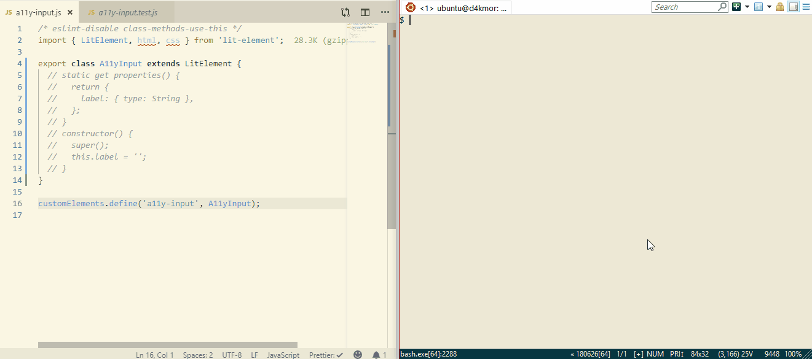
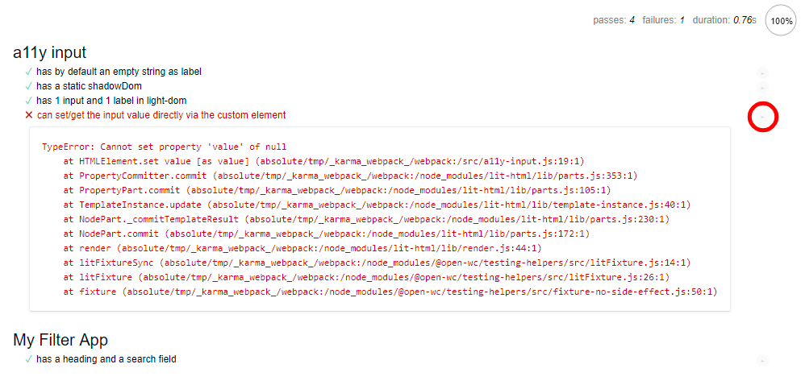
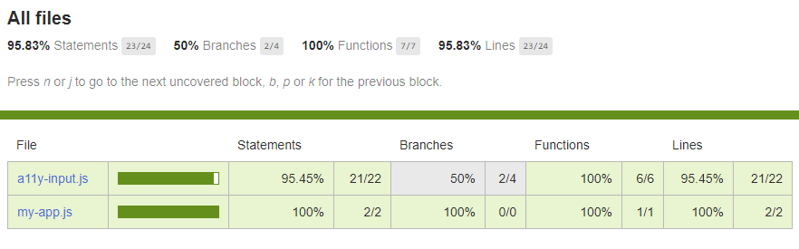
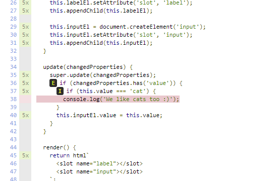
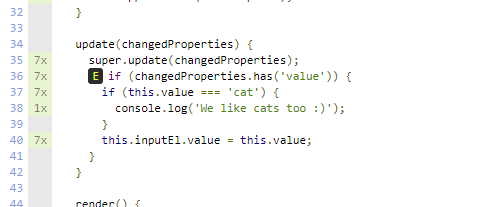

Whenever you ship something to be used by others, you take on a responsibility to deliver safe and stable code. One way to address this is by testing your code.

No matter how small - no matter how simple your project, there should always ideally be tests.

> Yes, I know reality hits hard and there will be many cases where that doesn't happen - but you should always strive to have tests

### Disclaimer

In this tutorial, we're going to make a simple version of an input element. By the end of it, you'll gain the skills and knowledge to put open-wc testing tools to practice; and build a solid, accessible, and well-tested input component.

### Warning

This is an in-depth tutorial showing a few pitfalls and tough cases when working with web components. This is definitely for more advanced users. You should have a basic knowledge about [LitElement](https://lit-element.polymer-project.org/) and [JSDoc Types](https://dev.to/dakmor/type-safe-web-components-with-jsdoc-4icf). Having an idea what [Mocha](https://mochajs.org/), [Chai BDD](https://www.chaijs.com/api/bdd/), [Karma](https://karma-runner.github.io/latest/index.html) is might help a little as well.

> We are thinking about posting an easier digestible version of this so if that is something you would like to see - let us know in the comments.

If you want to play along - all the code is on [github](https://github.com/daKmoR/testing-workflow-for-web-components).

## Let's Get Started!

Run in your console

```bash
$ npm init @open-wc

# Results in this flow
✔ What would you like to do today? › Scaffold a new project
✔ What would you like to scaffold? › Web Component
# Select with space! "Testing" => just enter will move one with no selection
✔ What would you like to add? › Testing
✔ Would you like to scaffold examples files for? › Testing
✔ What is the tag name of your application/web component? … a11y-input
✔ Do you want to write this file structure to disk? › Yes
Writing..... done
✔ Do you want to install dependencies? › No
```

For more details please see [https://open-wc.org/testing/](https://open-wc.org/testing/).

Delete `src/A11yInput.js`

Modify `src/a11y-input.js` to:

```js
import { LitElement, html, css } from 'lit-element';

export class A11yInput extends LitElement {}

customElements.define('a11y-input', A11yInput);
```

and `test/a11y-input.test.js` to:

```js
/* eslint-disable no-unused-expressions */
import { html, fixture, expect } from '@open-wc/testing';

import '../src/a11y-input.js';

/**
 * @typedef {import('../src/a11y-input.js').A11yInput} A11yInput
 */

describe('a11y input', () => {
  it('has by default an empty string as label', async () => {
    const el = /** @type {A11yInput} */ (await fixture('<a11y-input></a11y-input>'));
    expect(el.label).to.equal('');
  });
});
```

Our tests so far consist of a single feature (the `label` property) and a single assertion (`expect`). We're using karma and chai's <abbr title="behaviour/business-driven-development">BDD</abbr> syntax, so we group sets of tests (`it`) under the features or APIs they relate to (`describe`).

Let's see if everything works correctly by running: `npm run test`.

```
SUMMARY:
✔ 0 tests completed
✖ 1 test failed

FAILED TESTS:
  a11y input
    ✖ has by default an empty string as label
      HeadlessChrome 73.0.3683 (Windows 10.0.0)
    AssertionError: expected undefined to equal ''

      + expected - actual

      -[undefined]
      +""
```

Awesome - just as expected (🥁), we have a failing test :)

Let's switch into watch mode, which will run the tests continuously whenever you make changes to your code.

`npm run test:watch`



The following code was added in the video above to `src/a11y-input.js`:

```js
static get properties() {
  return {
    label: { type: String },
  };
}

constructor() {
  super();
  this.label = '';
}
```

So far, so good? Still with us? Great! Let's up the game a little...

### Adding a Test for Shadow DOM

Let's add an assertion to test the contents of our element's shadow root.

If we want to be sure that our element behaves/looks the same we should make sure its dom structure remains the same.
So let's compare the actual shadow dom to what we want it to be.

```js
it('has a static shadowDom', async () => {
  const el = /** @type {A11yInput} */ (await fixture(html` <a11y-input></a11y-input> `));
  expect(el.shadowRoot.innerHTML).to.equal(`
    <slot name="label"></slot>
    <slot name="input"></slot>
  `);
});
```

As expected, we get:

```
✖ has a static shadowDom
AssertionError: expected '' to equal '\n      <slot name="label"></slot>\n      <slot name="input"></slot>\n    '

  + expected - actual

  +
  +      <slot name="label"></slot>
  +      <slot name="input"></slot>
  +
```

So let's implement that in our element.

```js
render() {
  return html`
    <slot name="label"></slot>
    <slot name="input"></slot>
  `;
}
```

Interesting, the test should be green... but it's not :thinking: Let's take a look.

```
✖ has a static shadowDom
AssertionError: expected '<!---->\n      <slot name="label"></slot>\n      <slot name="input"></slot>\n    <!---->' to equal '\n        <slot name="label"></slot>\n        <slot name="input"></slot>\n    '

  + expected - actual

  -<!---->
  -      <slot name="label"></slot>
  -      <slot name="input"></slot>
  -    <!---->
  +
  +        <slot name="label"></slot>
  +        <slot name="input"></slot>
  +
```

You may have noticed those weird empty comment `<!---->` tags. They are markers that `lit-html` uses to remember where dynamic parts are, so it can be updated efficiently. For testing, however, this can be a little annoying to deal with.

If we use `innerHTML` to compare the DOM, we'd have to rely on simple string equality. Under those circumstances, we'd have to exactly match the generated DOM's whitespace, comments, etc; in other words: it will need to be a perfect match. Really all we need to test is that the elements we want to render are rendered. We want to test the _semantic_ contents of the shadow root.

Fortunately, we've got you covered. If you're using `@open-wc/testing` then it automatically loads the `@open-wc/semantic-dom-diff` chai plugin for us to use.

So let's try it out :muscle:

```js
// old:
expect(el.shadowRoot.innerHTML).to.equal(`...`);

// new:
expect(el).shadowDom.to.equal(`
  <slot name="label"></slot>
  <slot name="input"></slot>
`);
```

Bam :tada:

```
a11y input
  ✔ has by default an empty string as a label
  ✔ has a static shadowDom
```

### How does shadowDom.to.equal() work?

1. It gets the `innerHTML` of the shadow root
2. Parses it (actually, the browser parses it - no library needed)
3. Normalizes it (potentially every tag/property on its own line)
4. Parses and normalizes the expected HTML string
5. Passes both normalized DOM strings on to chai's default compare function
6. In case of failure, groups, and displays any differences in a clear manner

If you want to know more, please check out the documentation of [semantic-dom-diff](https://open-wc.org/testing/semantic-dom-diff.html).

### Testing the "Light" DOM

We can do exactly the same thing with the light DOM. (The DOM which will be provided by our user or our defaults, i.e. the element's `children`).

```js
it('has 1 input and 1 label in light-dom', async () => {
  const el = /** @type {A11yInput} */ (await fixture(html`
    <a11y-input .label=${'foo'}></a11y-input>
  `));
  expect(el).lightDom.to.equal(`
    <label slot="label">foo</label>
    <input slot="input">
  `);
});
```

And let's implement it.

```js
connectedCallback() {
  super.connectedCallback();
  this.labelEl = document.createElement('label');
  this.labelEl.innerText = this.label;
  this.labelEl.setAttribute('slot', 'label');
  this.appendChild(this.labelEl);

  this.inputEl = document.createElement('input');
  this.inputEl.setAttribute('slot', 'input');
  this.appendChild(this.inputEl);
}
```

So we tested our light and shadow dom :muscle: and our tests run clean :tada:

> Note: Using the DOM API in a lit-element's lifecycle is an anti-pattern, however to allow for <abbr title="accessibility">a11y</abbr> it might be a real use case - anyways it's great for illustration purposes

### Using Our Element in an App

So now that we have a basic a11y input let's use it - and test it - in our application.

Again we start with a skeleton `src/my-app.js`

```js
/* eslint-disable class-methods-use-this */
import { LitElement, html, css } from 'lit-element';

export class MyApp extends LitElement {}

customElements.define('my-app', MyApp);
```

And our test in `test/my-app.test.js`;

```js
/* eslint-disable no-unused-expressions */
import { html, fixture, expect } from '@open-wc/testing';

import '../src/my-app.js';

/**
 * @typedef {import('../src/my-app.js').MyApp} MyApp
 */

describe('My Filter App', () => {
  it('has a heading and a search field', async () => {
    const el = /** @type {MyApp} */ (await fixture(html` <my-app .label=${'foo'}></my-app> `));
    expect(el).shadowDom.to.equal(`
      <h1>My Filter App</h1>
      <a11y-input></a11y-input>
    `);
  });
});
```

Run the test => fails and then we add the implementation to `src/a11y-input.js`

```js
render() {
  return html`
    <h1>My Filter App</h1>
    <a11y-input></a11y-input>
  `;
}
```

But oh no! That should be green now...

```
SUMMARY:
✔ 3 tests completed
✖ 1 test failed

FAILED TESTS:
  My Filter App
    ✖ has a heading and a search field
    AssertionError: expected '<h1>\n  My Filter App\n</h1>\n<a11y-input>\n  <label slot="label">\n  </label>\n  <input slot="input">\n</a11y-input>\n' to equal '<h1>\n  My Filter App\n</h1>\n<a11y-input>\n</a11y-input>\n'

      + expected - actual

       <h1>
         My Filter App
       </h1>
       <a11y-input>
      -  <label slot="label">
      -  </label>
      -  <input slot="input">
       </a11y-input>
```

What is happening?
Do you remember that we had a specific test to ensure the light-dom of a11y-input?
So even if the users only puts `<a11y-input></a11y-input>` in his code - what actually comes out is

```html
<a11y-input>
  <label slot="label"></label>
  <input slot="input" />
</a11y-input>
```

e.g. `a11y-input` is actually creating nodes inside of your `my-app` shadow dom. Preposterous! For our example here we say that's what we want.
So how can we still test it?

Luckily `.shadowDom` has another ace up its sleeve; it allows us to ignore parts of dom.

```js
expect(el).shadowDom.to.equal(
  `
  <h1>My Filter App</h1>
  <a11y-input></a11y-input>
`,
  { ignoreChildren: ['a11y-input'] },
);
```

We can even specify the following properties as well:

- `ignoreChildren`
- `ignoreTags`
- `ignoreAttributes` (globally or for specific tags)

For more details please see [semantic-dom-diff](https://open-wc.org/testing/semantic-dom-diff.html).

#### Snapshot testing

If you have a lot of big dom trees writing/maintaining all those manually written expects is going to be tough.
To help you with that there are semi/automatic snapshots.

So if we change our code

```js
// from
expect(el).shadowDom.to.equal(`
  <slot name="label"></slot>
  <slot name="input"></slot>
`);

// to
expect(el).shadowDom.to.equalSnapshot();
```

If we now execute `npm run test` it will create a file `__snapshots__/a11y input.md` and fill it with something like this

````
## `a11y input`

#### `has a static shadowDom`

```html
<slot name="label">
</slot>
<slot name="input">
</slot>
```

````

What we wrote before by hand can now be auto-generated on init or forcefully via `npm run test:update-snapshots`.

If the file `__snapshots__/a11y input.md` already exists it will compare it with the output and you will get errors if your html output changed.

```
FAILED TESTS:
  a11y input
    ✖ has a static shadowDom
      HeadlessChrome 73.0.3683 (Windows 10.0.0)
    AssertionError: Received value does not match stored snapshot 0

      + expected - actual

      -<slot name="label-wrong">
      +<slot name="label">
       </slot>
       <slot name="input">
      -</slot>
      +</slot>
```

For more details please see [semantic-dom-diff](https://open-wc.org/testing/semantic-dom-diff.html).

I think that's now enough about comparing dom trees...
It's time for a change :hugs:

### Code coverage

Another useful metric we get when testing with the open-wc setup is code coverage.
So what does it mean and how can we get it? [Code coverage](https://www.wikiwand.com/en/Code_coverage) is a measure of _how much_ of our code is checked by tests. If there's a line, statement, function, or branch (e.g. `if`/`else` statement) that our tests don't cover our coverage score will be affected.
A simple `npm run test` is all we need and you will get the following:

```
=============================== Coverage summary ===============================
Statements   : 100% ( 15/15 )
Branches     : 100% ( 0/0 )
Functions    : 100% ( 5/5 )
Lines        : 100% ( 15/15 )
================================================================================
```

Which means that 100% of our code's statements, branches, functions, and lines are covered by tests. Pretty neat!

So let's go the other way and add code to `src/a11y-input.js` before adding a test. Let's say we want to access the value of our input directly via our custom element and whenever its value is 'cat' we want to log something.

```js
get value() {
  return this.inputEl.value;
}

set value(newValue) {
  if (newValue === 'cat') {
    console.log('We like cats too :)');
  }
  this.inputEl.value = newValue;
}
```

It's a vastly different result

```
SUMMARY:
✔ 4 tests completed
TOTAL: 4 SUCCESS

=============================== Coverage summary ===============================
Statements   : 81.82% ( 18/22 )
Branches     : 0% ( 0/2 )
Functions    : 75% ( 6/8 )
Lines        : 81.82% ( 18/22 )
================================================================================
06 04 2019 10:40:45.380:ERROR [reporter.coverage-istanbul]: Coverage for statements (81.82%) does not meet global threshold (90%)
06 04 2019 10:40:45.381:ERROR [reporter.coverage-istanbul]: Coverage for lines (81.82%) does not meet global threshold (90%)
06 04 2019 10:40:45.381:ERROR [reporter.coverage-istanbul]: Coverage for branches (0%) does not meet global threshold (90%)
06 04 2019 10:40:45.381:ERROR [reporter.coverage-istanbul]: Coverage for functions (75%) does not meet global threshold (90%)
```

Our coverage is way lower than before. Our test command even fails, even though all the tests run successfully.
This is because by default open-wc's config sets a 90% threshold for code coverage.

If we want to improve coverage we need to add tests - so let's do it

```js
it('can set/get the input value directly via the custom element', async () => {
  const el = /** @type {A11yInput} */ (await fixture(html`
    <a11y-input .value=${'foo'}></a11y-input>
  `));
  expect(el.value).to.equal('foo');
});
```

uh oh :scream: we wanted to improve coverage but now we need fix an actual bug first :disappointed:

```
FAILED TESTS:
  a11y input
    ✖ can set/get the input value directly via the custom element
    TypeError: Cannot set property 'value' of null        at HTMLElement.set value [as value]
    // ... => long error stack
```

That was unexpected... on first glance, I don't really know what that means... better to check some actual nodes and inspect them in the browser.

### Debugging in the Browser

When we run our test with watch, karma sets up a persistent browser environment to run tests in.

- Be sure you started with `npm run test:watch`
- visit [http://localhost:9876/debug.html](http://localhost:9876/debug.html)

You should see something like this


You can click on the circled play button to only run one individual test.

So let's open the Chrome Dev Tools (F12) and put a debugger in the test code.

```js
it('can set/get the input value directly via the custom element', async () => {
  const el = /** @type {A11yInput} */ (await fixture(html`
    <a11y-input .value=${'foo'}></a11y-input>
  `));
  debugger;
  expect(el.value).to.equal('foo');
});
```

Dang.. the error happens even before that point...
"Fatal" errors like this are a little tougher as they are not failing tests but sort of a complete meltdown of your full component.

Ok, let's put some code in the `setter` directly.

```js
set value(newValue) {
  debugger;
```

Alright, that worked so our chrome console we write `console.log(this)` let's see what we have here

```js
<a11y-input>#shadow-root (open)</a11y-input>
```

Ahh there we have it - the shadow dom is not yet rendered when the setter is called.
So let's be safe and add a check before

```js
set value(newValue) {
  if (newValue === 'cat') {
    console.log('We like cats too :)');
  }
  if (this.inputEl) {
    this.inputEl.value = newValue;
  }
}
```

Fatel error is gone :tada:
But we now have a failing test :sob:

```
✖ can set/get the input value directly via the custom element
AssertionError: expected '' to equal 'foo'
```

We may need a change of tactic :thinking:
We can add it as a separate `value` property and sync when needed.

```js
static get properties() {
  return {
    label: { type: String },
    value: { type: String },
  };
}

constructor() {
  super();
  this.label = '';
  this.value = '';
  // ...
}

update(changedProperties) {
  super.update(changedProperties);
  if (changedProperties.has('value')) {
    if (this.value === 'cat') {
      console.log('We like cats too :)');
    }
    this.inputEl.value = this.value;
  }
}
```

And we're finally back in business! :tada:

ok bug fixed - can we please get back to coverage? thank you :pray:

### Back to coverage

With this added test we made some progress.

```
=============================== Coverage summary ===============================
Statements   : 95.83% ( 23/24 )
Branches     : 50% ( 2/4 )
Functions    : 100% ( 7/7 )
Lines        : 95.83% ( 23/24 )
================================================================================
06 04 2019 13:18:54.902:ERROR [reporter.coverage-istanbul]: Coverage for branches (50%) does not meet global threshold (90%)
```

However we are still not fully there - the question is why?

To find out open `coverage/index.html` in your browser. No web server needed just open the file in your browser - on a mac you can do that from the command line with `open coverage/index.html`

You will see something like this



Once you click on `a11y-input.js` you get a line by line info how often they got executed.
So we can immediately see which lines are not executed yet by our tests.



So let's add a test for that

```js
it('logs "We like cats too :)" if the value is "cat"', async () => {
  const el = /** @type {A11yInput} */ (await fixture(html`
    <a11y-input .value=${'cat'}></a11y-input>
  `));
  // somehow check that console.log was called
});
```

```
=============================== Coverage summary ===============================
Statements   : 100% ( 24/24 )
Branches     : 75% ( 3/4 )
Functions    : 100% ( 7/7 )
Lines        : 100% ( 24/24 )
================================================================================
```

With that, we are back at 100% on statements but we still have something missing on branches.
Let's see why?



This `E` means `else path not taken`.
So whenever the function `update` gets called there is always a property `value` in the changedProperties.

We have `label` as well so it's a good idea to test it. :+1:

```js
it('can update its label', async () => {
  const el = /** @type {A11yInput} */ (await fixture('<a11y-input label="foo"></a11y-input>'));
  expect(el.label).to.equal('foo');
  el.label = 'bar';
  expect(el.label).to.equal('bar');
});
```

boom 100% :muscle: we win :1st_place_medal:

```
=============================== Coverage summary ===============================
Statements   : 100% ( 24/24 )
Branches     : 100% ( 4/4 )
Functions    : 100% ( 7/7 )
Lines        : 100% ( 24/24 )
================================================================================
```

But wait we didn't even finish the test above - the code is still

```js
// somehow check that console.log was called
```

#### How come we have 100% test coverage?

Lets first try to understand how code coverage works :thinking:
The way code coverage gets measured is by applying a form of `instrumentation`. In short, before our code is executed it gets changed (`instrumented`) and it behaves something like this:

**Note:** This is a super simplified version for illustration purposes.

```js
if (this.value === 'cat') {
  console.log('We like cats too :)');
}

// becomes something like this (psoido code)
__instrumented['functionUpdate'] += 1;
if (this.value === 'cat') {
  __instrumented['functionUpdateBranch1yes'] += 1;
  console.log('We like cats too :)');
} else {
  __instrumented['functionUpdateBranch1no'] += 1;
}
```

Basically, your code gets littered with many many flags. Based on which flags get trigger a statistic gets created.

So 100% test coverage only means that every line you have in your code was executed at least once after all your tests finished. It does _not_ mean that you tested everything, or if your tests make the correct assertions.

So even though we already have 100% code coverage we are still going to improve our log test.

You should, therefore, see code coverage as a tool that only gives you guidance and help on spotting some missing tests, rather than a hard guarantee of code quality.

### Spying on Code

If you want to check how often or with which parameters a function gets called, that's called spying.
open-wc recommends the venerable [sinon](https://sinonjs.org/) package, which provides many tools for spying and other related tasks.

```bash
npm i -D sinon
```

So you create a spy on a specific object and then you can check how often it gets called.

```js
import sinon from 'sinon';

it('outputs "We like cats too :)" if the value is set to "cat"', async () => {
  const logSpy = sinon.spy(console, 'log');
  const el = /** @type {A11yInput} */ (await fixture(html` <a11y-input></a11y-input> `));

  el.value = 'cat';
  expect(logSpy.callCount).to.equal(1);
});
```

Uh oh... the test fails:

```
AssertionError: expected 0 to equal 1
```

Messing with global objects like `console` might have [side effects](https://gyandeeps.com/console-stubbing/) so let's better refactor using a dedicated log function.

```js
update(changedProperties) {
  super.update(changedProperties);
  if (changedProperties.has('value')) {
    if (this.value === 'cat') {
      this.log('We like cats too :)');
    }
    this.inputEl.value = this.value;
  }
}

log(msg) {
  console.log(msg);
}
```

This result in no global object in our test code - sweet :hugs:

```js
it('logs "We like cats too :)" if the value is set to "cat"', async () => {
  const el = /** @type {A11yInput} */ (await fixture(html` <a11y-input></a11y-input> `));
  const logSpy = sinon.spy(el, 'log');

  el.value = 'cat';
  expect(logSpy.callCount).to.equal(1);
});
```

However, we still get the same error. Let's debug... boohoo apparently `update` is not sync - a wrong assumption I made :see*no_evil: I am saying \_assumptions are dangerous* quite often - still I fall for it from time to time :cry:.

So what can we do? Sadly there seems to be no public api to do some sync actions triggered by an property update.
Let's create an issue for it https://github.com/Polymer/lit-element/issues/643.

For now apparently, the only way is to rely on a _private_ api. :see_no_evil:
Also, we needed to move the value sync to `updated` so it gets executed after every dom render.

```js
_requestUpdate(name, oldValue) {
  super._requestUpdate(name, oldValue);
  if (name === 'value') {
    if (this.value === 'cat') {
      this.log('We like cats too :)');
    }
  }
}

updated(changedProperties) {
  super.updated(changedProperties);
  if (changedProperties.has('value')) {
    this.inputEl.value = this.value;
  }
}
```

and here is the updated test for the logging

```js
it('logs "We like cats too :)" if the value is set to "cat"', async () => {
  const el = /** @type {A11yInput} */ (await fixture(html` <a11y-input></a11y-input> `));
  const logSpy = sinon.spy(el, 'log');

  el.value = 'cat';
  expect(logSpy.callCount).to.equal(1);
  expect(logSpy.calledWith('We like cats too :)')).to.be.true;

  // different values do NOT log
  el.value = 'foo';
  expect(logSpy.callCount).to.equal(1);

  el.value = 'cat';
  expect(logSpy.callCount).to.equal(2);
});
```

wow, that was a little tougher than expected but we did it :muscle:

```
SUMMARY:
✔ 7 tests completed
TOTAL: 7 SUCCESS
```

### Running Tests Without Karma Framework

The Karma framework is powerful and feature-rich, but sometimes we might want to pare-down our testing regiment. The nice thing with everything we proposed so far is that we only used browser-standard es modules with no need for transpilation, [with the one exception of bare modules specifiers](https://open-wc.org/about/rationales.html#workflows).
So just by creating a `test/index.html`.

```html
<!DOCTYPE html>
<html>
  <head>
    <meta charset="utf-8" />
    <link href="../node_modules/mocha/mocha.css" rel="stylesheet" />
    <script src="../node_modules/mocha/mocha.js"></script>
    <script src="../node_modules/@webcomponents/webcomponentsjs/webcomponents-bundle.js"></script>
  </head>
  <body>
    <div id="mocha"></div>
    <script>
      mocha.setup('bdd');
    </script>

    <script type="module">
      import './a11y-input.test.js';
      import './my-app.test.js';

      mocha.checkLeaks();
      mocha.run();
    </script>
  </body>
</html>
```

and opening it via `owc-dev-server` in chrome, it will work perfectly fine.
We got everything up and running without `webpack` or `karma` - sweet :hugs:

### Do the Cross-Browser Thing

We now feel pretty comfortable with our web component. It's tested and covered; there's just one more step - we want to make sure it runs and is tested in all browsers.

Open WC recommends [Browserstack](https://www.browserstack.com/) for cross-browser testing. If you haven't set it up yet, you can do it now - here is the link again - [https://open-wc.org/testing/](https://open-wc.org/testing/).

So let's just run it

```
npm run test:bs

SUMMARY:
✔ 42 tests completed
TOTAL: 42 SUCCESS
```

Yeah, that works nicely! :hugs:

If there are failing tests it will output them in the summary with the specific browser where it failed.

```
SUMMARY:
✔ 40 tests completed
✖ 2 tests failed

FAILED TESTS:
  a11y input
    ✖ has a static shadowDom
      Firefox 64.0.0 (Windows 10.0.0)
      Safari 12.0.0 (Mac OS X 10.14.0)
    expected '<slot name="label">\n</slot>\n<slot name="input">\n</slot>\n<style>\n</style>\n' to equal '<slot name="label">\n</slot>\n<slot name="input">\n</slot>\n'

      + expected - actual

       <slot name="label">
       </slot>
       <slot name="input">
       </slot>
      -<style>
      -</style>
```

If you need to debug a particular browser:

- `npm run test:legacy:watch`
- visit [http://localhost:9876/debug.html](http://localhost:9876/debug.html) with that browser (either it locally or via browserstack)
- select a specific test (or use `it.only()` in code)
- start debugging

Also if you want to adjust the browser that gets tested you can adjust your `karma.bs.config.js`.

For example, if you want to add the `Firefox ESR` to your list.

```js
module.exports = config => {
  config.set(
    merge(bsSettings(config), createBaseConfig(config), {
      browserStack: {
        project: 'testing-workflow-for-web-components',
      },
      browsers: ['bs_win10_firefox_ESR'],
      // define browsers
      // https://www.browserstack.com/automate/capabilities
      customLaunchers: {
        bs_win10_firefox_ESR: {
          base: 'BrowserStack',
          browser: 'Firefox',
          browser_version: '60',
          os: 'Windows',
          os_version: '10',
        },
      },
    }),
  );

  return config;
};
```

Or maybe you want to test only 2 specific browsers?

```js
merge.strategy({
  browsers: 'replace',
})(bsSettings(config), createBaseConfig(config), {
  browserStack: {
    project: 'testing-workflow-for-web-components',
  },
  browsers: [
    'bs_win10_ie_11',
    'bs_win10_firefox_ESR',
  ],
}),
```

**Note:** This uses the [webpack merge strategies](https://github.com/survivejs/webpack-merge#merging-with-strategies) replace.

## Quick Recap

- Testing is important for every project. Be sure to write as many as you can.
- Try to keep your code coverage high, but remember it's not a magic guarantee, so it doesn't always need to be 100%.
- Debug in the browser via `npm run test:watch`. For legacy browsers, use `npm run test:legacy.watch`.

## What's Next?

- Run the tests in your CI (works perfectly well together with browserstack). See our recommendations at [automating](https://open-wc.org/automating/).

Follow us on [Twitter](https://twitter.com/openwc), or follow me on my personal [Twitter](https://twitter.com/dakmor).
Make sure to check out our other tools and recommendations at [open-wc.org](https://open-wc.org).

Thanks to [Pascal](https://dev.to/thepassle) and [Benny](https://dev.to/bennypowers) for feedback and helping turn my scribbles to a followable story.

```

```
