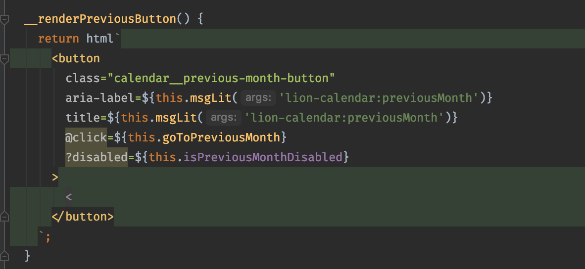

# Tools >> IDE ||10

Your integrated development environment (IDE) is your primary tool while working with code, we recommend the following tools and plugins to make developing web components easier.

## Visual Studio Code

We recommend [VSCode](https://code.visualstudio.com/). For setup please visit the instructions on the Visual Studio Code [homepage](https://code.visualstudio.com/).

### Configuration

We recommend the following user settings:

```json
{
  "files.autoSave": "onWindowChange",
  "editor.tabSize": 2,
  "files.trimTrailingWhitespace": true,
  "[markdown]": {
    "files.trimTrailingWhitespace": false
  }
}
```

### Plugins

We recommend the following plugins:

- [ESLint](https://marketplace.visualstudio.com/items?itemName=dbaeumer.vscode-eslint)
  Get ESLint feedback directly in your IDE => more details under [Linting](./linting-and-formatting.md)
- [lit-plugin](https://marketplace.visualstudio.com/items?itemName=runem.lit-plugin)
  Syntax highlighting, type checking and code completion for lit-html
- [prettier](https://marketplace.visualstudio.com/items?itemName=esbenp.prettier-vscode) Code formatter.

## Atom

[Atom](https://atom.io/) is an IDE created by Github. It provides near-native support for working with web components and has great support for template literals.

### Plugins

- [prettier-atom](https://atom.io/packages/prettier-atom) - Template literal highlighting and formatting

## Intellij IDEA and other Jetbrains variants

[Intellij IDEA](https://www.jetbrains.com/idea/) is a Java IDE for developing computer software. It is developed by JetBrains (formerly known as IntelliJ) and is available as an Apache 2 Licensed community edition and in a proprietary commercial edition.

Syntax highlighting from HTML and CSS in template literals should be supported out of the box. Generic web component related functionalities such as Custom Elements support and completion is also available. You can read more about it [here](https://blog.jetbrains.com/phpstorm/2013/10/phpstorm-7-web-toolkit-javascript-templates-web-components-support/).



Due to the support available directly in the IDE, the ecosystem for plugins is very limited and we do not recommend any.

## Sublime Text 3

[Sublime Text 3](https://www.sublimetext.com/3) is officially called a text editor however Sublime Text features plugins which give it a lot of the possibilities like an IDE. It is available for Windows, Linux, and OSX and can be evaluated for free.

### Plugins

- [Lit Element Syntax Highlighting](https://packagecontrol.io/packages/LitElement%20Syntax%20Highlighting) - Syntax highlighting

## Vim & NeoVim

Vim can be configured similiarly to an IDE, and with a vast amount of plugins, can be used to create a fluid development experience
with lit-html and javascript.

### Plugins

- [vim-html-template-literals](https://github.com/jonsmithers/vim-html-template-literals) Get syntax highlighting for html`and css` tags
- [vim-javascript](https://github.com/pangloss/vim-javascript) Required by vim-html-template-literals. Provides Javascript syntax highlighting
- [typescript-vim](https://github.com/leafgarland/typescript-vim) Same as vim-javascript but for Typescript
- [vim-css-color](https://github.com/ap/vim-css-color) Highlight color codes with corresponding color
- [vim-closetag](https://github.com/alvan/vim-closetag) Automatically close HTML tags (can be used with vim-html-template-literals)
- [NeoFormat](https://github.com/sbdchd/neoformat) Format your code. Works together with prettier

### Configuration

Install the plugins with your favorite Vim package manager.

Example with [vim-plug](https://github.com/junegunn/vim-plug)

```vim
call plug#begin('~/.vim/plugged')

Plug 'jonsmithers/vim-html-template-literals'
Plug 'pangloss/vim-javascript'
Plug 'ap/vim-css-color'
Plug 'sbdchd/neoformat'

call plug#end()

```

Configuring vim-html-template-literals

```vim
  "--- LIT highlighting and autclosing
  let g:htl_css_templates = 1
  let g:htl_all_templates = 1
  let g:closetag_filetypes = 'html,xhtml,phtml,javascript,typescript'
  let g:closetag_regions = {
        \ 'typescript.tsx': 'jsxRegion,tsxRegion,litHtmlRegion',
        \ 'javascript.jsx': 'jsxRegion,litHtmlRegion',
        \ 'javascript':     'litHtmlRegion',
        \ 'typescript':     'litHtmlRegion',
        \ }
```

Configuring Neoformat to format on save

```vim
autocmd BufWritePre *.js Neoformat
autocmd BufWritePre *.ts Neoformat
autocmd BufWritePre *.html Neoformat
```
