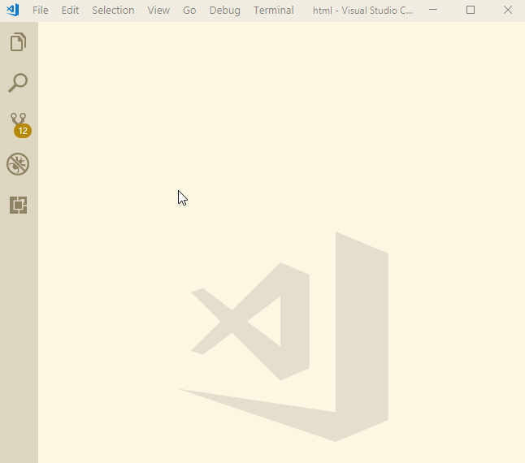

# IDE

Your IDE is your primary tool while working with code.

## Visual Studio Code

We recommend [VSCode](https://code.visualstudio.com/).

For Setup please visit its [homepage](https://code.visualstudio.com/) and follow installation instructions there.

## Configuration

We recommend the following user settings:
```json
{
    "workbench.colorTheme": "Solarized Light",
    "files.autoSave": "onWindowChange",
    "editor.tabSize": 2,
    "files.trimTrailingWhitespace": true,
    "[markdown]": {
        "files.trimTrailingWhitespace": false
    },
}
```
**How to set up**:
1. File > Preferences > Settings
1. click on "..." > Open settings.json



## Plugins

We recommend the following plugins:

* [ESLint](https://marketplace.visualstudio.com/items?itemName=dbaeumer.vscode-eslint)  
Get ESLint feedback directly in your IDE => more details under [Linting](./recommodations/linting)
* [es6-string-html](https://marketplace.visualstudio.com/items?itemName=Tobermory.es6-string-html)  
Highlights all your html tagged template literal
* [es6-string-css](https://marketplace.visualstudio.com/items?itemName=bashmish.es6-string-css)  
Highlights all your css tagged template literal
