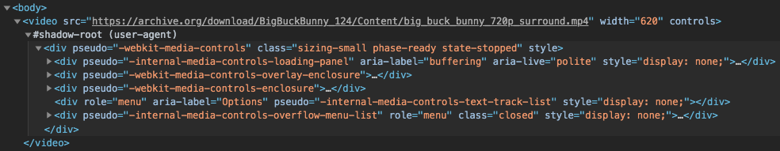

# Basics: Web Component

## Introduction
Web Components are a collection of low-level browser APIs that enable component based development in the browser.

In this codelab you will learn about the three basic Web Component APIs:
- Custom Elements
- Templates
- Shadow DOM

## Setup
For this codelab you need:
- A web browser which supports Web Components: Firefox, Safari, Chrome or any Chromium based browser.
- Basic knowledge of HTML, CSS and Javascript.
- Any coding environment which can display a static HTML page, we recommend an online editor like [jsbin](https://jsbin.com/?html,output).
- If using a local editor, any simple web server will work. For example [es-dev-server](https://open-wc.org/developing/es-dev-server.html#getting-started).

To start off, let's create a basic HTML page. If you see hello world, you're good to go!

```html
<!DOCTYPE html>

<html>
  <body>
    <h1>Hello world!</h1>
  </body>
</html>
```

## Custom Elements
First, we will take a look at the most important Web Component API: **Custom Elements**.

To get started, modify your html page to wrap the "Hello world" message in an element called `cool-heading`:

```html
<cool-heading>
  <h1>Hello world!</h1>
</cool-heading>
```

This isn't any HTML element that the browser knows about. When the browser encounters an unknown HTML tag like our `<cool-heading>`, it will just render it as an inline element and move on.

By using the Custom Elements API, we can tell the user what to do with the HTML tag we added. Start by adding a new script tag:

```html
<script>
  // your code will go here
</script>
```

We can define the behavior of our custom element through a class which extends from `HTMLElement`. This is the base class which powers all native elements as well. Let's go ahead and create a class for our heading element:

```js
class CoolHeading extends HTMLElement {
  connectedCallback() {
    console.log('cool heading connected!');
  }
}
```

After creating our class we can associate it with a tagname by defining it in the custom elements registry. Now whenever the browser sees a `<cool-heading>` tag, the browser will actually instantiate and apply our class to the element:

```js
customElements.define('cool-heading', CoolHeading);
```

If we refresh the our page in the browser, we should see the message `cool heading custom element connected!` logged in the terminal. Congratulations, you've created your first custom element!

<details>
  <summary>
    View full code
  </summary>

```html
<!DOCTYPE html>

<html>
  <body>
    <cool-heading>
      <h1>Hello world!</h1>
    </cool-heading>

    <script>
      class CoolHeading extends HTMLElement {
        connectedCallback() {
          console.log('cool heading custom element connected!');
        }
      }

      customElements.define('cool-heading', CoolHeading);
    </script>
  </body>
</html>
```
</details>

## Customizing our element

<aside class="notice">
  We show examples using imperative DOM manipulation to make it easy to understand the basics. Unless you are building super portable components, you will likely use some helper libraries for rendering. We will look into that later in the codelab.
</aside>

In the previous step you learned how to set up a basic custom element. Now it's time to actually make it do something useful.

When the browser instantiates our custom element it calls some lifecycle callbacks. For now, these are the most important ones we need to know about:

```js
class MyElement extends HTMLElement {
  constructor() {
    super();
    // called when the class is instantiated (standard js)
  }

  connectedCallback() {
    /**
     * called when the element is connected to the page
     * this can be called multiple times during the element's lifecycle
     * for example when using drag&drop to move elements around
     */
  }

  disconnectedCallback() {
    // called when the element is disconnected from the page
  }
}
```

Because our element extends from `HTMLElement`, when it is instantiated the class instance is an actual live DOM element. All the methods and properties we are familiar with from regular dom element exist here as well.

For example let's add some styles to our element:

```js
class CoolHeading extends HTMLElement {
  connectedCallback() {
    this.style.color = 'blue';
  }
}
```

To respond to user input, we can add an event listener to our element or one of it's children. Let's add one to change the color of our element on click:

```js
class CoolHeading extends HTMLElement {
  constructor() {
    super();

    this.addEventListener('click', () => {
      this.style.color = 'red';
    });
  }

  connectedCallback() {
    this.style.color = 'blue';
  }
}
```

We're adding the event listener in the constructor because the `connectedCallback` can be called multiple times during the lifecycle of our element, causing the event listener to be registered multiple times. If we run this code in the browser, the element should turn blue on click.

<details>
  <summary>
    View final result
  </summary>

```html
<!DOCTYPE html>

<html>
  <body>
    <cool-heading>
      <h1>Hello world!</h1>
    </cool-heading>

    <script>
      class CoolHeading extends HTMLElement {
        connectedCallback() {
          this.style.color = 'blue';

          this.addEventListener('click', () => {
            this.style.color = this.style.color === 'blue' ? 'red' : 'blue';
          });
        }
      }

      customElements.define('cool-heading', CoolHeading);
    </script>
  </body>
</html>
```
</details>

## Attributes
When building our own components, we often want to allow whoever is using our element to pass in some data or configuration. One of the simplest options for this is using attributes. You should already be familiar with them, since that's how native html elements work as well. For example the `href` on an anchor element:

```html
<a href="https://www.example.com/">My anchor</a>
```

Let's create a new custom element which localized a date based on the user's locale. It will take in a standard formatted date (yyyy-mm-dd), and display the localized date on the screen.

First, add the HTML:

```html
<localized-date date="1970-01-01"></localized-date>
```

Next, add the class definition:

```js
class LocalizedDate extends HTMLElement {
  connectedCallback() {
    const isoDate = this.getAttribute('date');
    const date = new Date(isoDate);
    this.textContent = date.toDateString();
  }
}

customElements.define('localized-date', LocalizedDate);
```

Remember that a custom element is an actual DOM node, so it has access to all the existing DOM APIs. In this case we can use `getAttribute` to get the value of the `date` attribute set in the HTML. Afterwards we can assign the localized date value to `textContent` which renders it as text within the localized date object:

```html
<localized-date date="1970-01-01">Thu Jan 01 1970</localized-date>
```

<aside class="notice">
Web Components are not limited to attributes alone. Raw HTML only supports setting attributes, but since web components are javascript objects you can set properties on them with any problems. This is ideal when passing complex data like objects or arrays. Most templating libraries offer this out of the box, you can learn more about this in the followup codelabs.
</aside>

<details>
  <summary>
    View final result
  </summary>

```html
<!DOCTYPE html>

<html>
  <body>
    <cool-heading>
      <h1>Hello world!</h1>
    </cool-heading>

    <script>
      class LocalizedDate extends HTMLElement {
        connectedCallback() {
          const isoDate = this.getAttribute('date');
          const date = new Date(isoDate);
          this.textContent = date.toDateString();
        }
      }

      customElements.define('localized-date', LocalizedDate);
    </script>
  </body>
</html>
```
</details>

## Templating
The second Web Components API we will look into is html templates. When writing web components, we usually need to do more than just setting some styles or text. We often need to render larger pieces of HTML as part a of our component, and updates parts of it when the user interacts with the page.

To do this efficiently, the browsers has a template element. With the template element, we can define the structure of a piece of HTML once upfront, and efficiently clone this each time the element is rendered on the page. This is a lot faster than recreating the same HTML structure each time.

Writing and cloning templates is (intentionally) pretty low level. This is what it would look like if we wanted to create a component which displays a list of Web Component APIs:

```js
const template = document.createElement('template');
template.innerHTML = `
  <h1>Basic Web Components APIs</h1>

  <ul>
    <li>Custom Elements</li>
    <li>Templates</li>
    <li>Shadow DOM</li>
  </ul>
`;

class WebComponentAPIs extends HTMLElement {
  connectedCallback() {
    this.innerHTML = template.content.cloneNode(true));
  }
}

customElements.define('web-component-apis', WebComponentAPIs);
```

If we have some dynamic parts in our template, we have to manually select dom nodes to do the updates after we rendered the initial template. So while templates are very powerful, out of the box they is not a great way to write components as a developer. Luckily there are great libraries available which build on top of template elements, these allow to write templates using a great declarative syntax.

For writing templates, we recommend the [lit-html](https://github.com/Polymer/lit-html) library. To use it with our web components, we can use it through [lit-element](https://github.com/Polymer/lit-element) library which takes care of some other boilerplate as well. Check out their websites for more background information. We will look at how they can be used in the next step.

## LitElement
LitElement is written and distributed as es modules, this means we can import using the browser's native module loader. First, let's create a new HTML page with a module script tag:

```html
<!DOCTYPE html>

<html>
  <body>
    <script type="module">

    </script>
  </body>
</html>
```

Inside the module, we can easily import LitElement from a CDN:

```js
import { LitElement } from 'https://unpkg.com/lit-element?module';
```

Next, we define our class. Instead of extending `HTMLElement`, we are now extending `LitElement`. `LitElement` extends `HTMLElement` already, so we're still writing an actual web component:

```js
class WebComponentApis extends LitElement {
  connectedCallback() {
    super.connectedCallback();
    console.log('lit element connected');
  }
}

customElements.define('web-component-apis', WebComponentApis);
```

```html
  <web-component-apis></web-component-apis>
```

If we run this in the browser you should see `hello world` logged to the terminal (remember to add the element tag to the HTML).

Because LitElement does some work in the connectedCallback as well, we need to ensure that we call `super.connectedCallback()` when we implement it ourselves as well.

Now that we have our element based on LitElement, we can start adding our template. For templating, LitElement uses `lit-html`. `lit-html` works by writing HTML inside of [template literals](https://developer.mozilla.org/en-US/docs/Web/JavaScript/Reference/Template_literals) which are basically multiline strings:

 ```js
const template = `
  <h1>Hello world</h1>
`;
 ```

 In order to create an actual `lit-html` template, we prefix the template literal with a special html tag:

 ```js
import { html } from 'https://unpkg.com/lit-element?module';

const template = html`
  <h1>Hello world</h1>
`;
 ```

This uses a js language feature called [tagged template literals](https://developer.mozilla.org/en-US/docs/Web/JavaScript/Reference/Template_literals#Tagged_templates), where `html` is just a function which returns the prepared template. We won't go into details of how it works exactly, but by using this syntax `lit-html` is actually able to very efficiently update the dynamic parts of your template when your element re-renders.

Most popular IDEs support syntax highlighting of HTML inside template literals, for some you might need to install a plugin. [See our IDE section](https://open-wc.org/developing/ide.html#visual-studio-code) to learn more about that.

`LitElement` works with a `render` function, which is called each time the element is updated. From this function we return a template which is rendered to the page. Let's take the list of Web Component APIs we saw in the previous step, and add it as a lit-html template:

```js
import { LitElement, html } from 'https://unpkg.com/lit-element?module';

class WebComponentApis extends LitElement {
  render() {
    return html`
      <h1>Basic Web Components APIs</h1>

      <ul>
        <li>Custom Elements</li>
        <li>Templates</li>
        <li>Shadow DOM</li>
      </ul>
    `;
  }
}

customElements.define('web-component-apis', WebComponentApis);
```

Make sure to add the component to the HTML as well:

```html
<web-component-apis></web-component-apis>
```

As you can see this is a much more declarative and convenient way to write your html templates.

<aside class="notice">
LitElement offers a lot more features than just rendering templates. We will look into those in the next codelab.
</aside>

<details>
  <summary>
    View final result
  </summary>

```html
<!DOCTYPE html>

<html>
  <body>
    <web-component-apis></web-component-apis>

    <script type="module">
      import { LitElement, html } from 'https://unpkg.com/lit-element?module';

      class WebComponentApis extends LitElement {
        render() {
          return html`
            <h1>Basic Web Components APIs</h1>

            <ul>
              <li>Custom Elements</li>
              <li>Templates</li>
              <li>Shadow DOM</li>
            </ul>
          `;
        }
      }

      customElements.define('web-component-apis', WebComponentApis);
    </script>
  </body>
</html>
```
</details>

## Shadow DOM
The last important Web Component API we will look into is Shadow DOM. Traditionally HTML and CSS have always been global. This scales pretty badly, we need to make sure that ids are unique on the page and css selector can get pretty complex. This is why many front-end frameworks offer some form of encapsulat. With Shadow DOM, this capability is now built into the browser.

The best way to visualize this, is to actually inspect the element we created in the previous step. In the DOM inspector you will see that the children rendered by our element are not direct children of our element, but are wrapped inside of a shadow root:


This shadow root is a special type of dom node, which encapsulates the elements inside it. Styles defined inside this shadow root do not leak out, and styles defined outside the shadow root do not reach in. Also, it's not possible to use `querySelector` to select elements inside or outside the shadow root. This way we can build reusable components and be confident that they will always work the same way in any environment.

Let's visualize this by adding some styles to our component. In `LitElement`, we can add styles to our component using a static `styles` field:

```js
import { LitElement, html, css } from 'https://unpkg.com/lit-element?module';

class WebComponentApis extends LitElement {
  static get styles() {
    return css`
      h1 {
        color: red;
      }

      ul {
        color: blue;
        list-style-type: upper-roman;
      }
    `;
  }

  render() {
    return html`
      <h1>Basic Web Components APIs</h1>

      <ul>
        <li>Custom Elements</li>
        <li>Templates</li>
        <li>Shadow DOM</li>
      </ul>
    `;
  }
}

customElements.define('web-component-apis', WebComponentApis);
```

When we refresh the page, our element should now be styled.

Next, let's add the same HTML outside our component on the page:

```html
<!DOCTYPE html>

<html>
  <body>
    <h1>Basic Web Components APIs</h1>

    <ul>
      <li>Custom Elements</li>
      <li>Templates</li>
      <li>Shadow DOM</li>
    </ul>

    <web-component-apis></web-component-apis>

    <script type="module">...</script>
  </body>
</html>
```

If we refresh the page again, we should see that the HTML inside our element's shadow root is styled according to the element's styles but the HTML outside it is not:


Next, we can define some global styles outside our component:

```html
<!DOCTYPE html>

<html>
  <body>
    <style>
      h1 {
        color: pink;
      }

      ul {
        font-weight: bold;
        list-style-type: decimal;
      }
    </style>

    <h1>Basic Web Components APIs</h1>

    <ul>
      <li>Custom Elements</li>
      <li>Templates</li>
      <li>Shadow DOM</li>
    </ul>

    <web-component-apis></web-component-apis>

    <script type="module">...</script>
  </body>
</html>
```

You will see in the browser that these only affect the DOM outside of our web component, it did not change any styles inside our component.

Not all CSS properties are blocked, inherited CSS properties link fonts do inherit through a shadow root. Fot example we can change the front of our page:

```html
<style>
  body {
    font-family: monospace;
  }

  h1 {
    color: pink;
  }

  ul {
    font-weight: bold;
    list-style-type: decimal;
  }
</style>
```

When you reload the page, all the texts on the page will have the new font.

<details>
  <summary>
    View final result
  </summary>

```html
<!DOCTYPE html>

<html>
  <body>
    <style>
      body {
        font-family: monospace;
      }

      h1 {
        color: pink;
      }

      ul {
        font-weight: bold;
        list-style-type: decimal;
      }
    </style>

    <h1>Basic Web Components APIs</h1>

    <ul>
      <li>Custom Elements</li>
      <li>Templates</li>
      <li>Shadow DOM</li>
    </ul>

    <web-component-apis></web-component-apis>

    <script type="module">
      import { LitElement, html } from 'https://unpkg.com/lit-element?module';

      class WebComponentApis extends LitElement {
        render() {
          return html`
            <h1>Basic Web Components APIs</h1>

            <ul>
              <li>Custom Elements</li>
              <li>Templates</li>
              <li>Shadow DOM</li>
            </ul>
          `;
        }
      }

      customElements.define('web-component-apis', WebComponentApis);
    </script>
  </body>
</html>
```
</details>

## Web Components in the wild
Web Components are being used in the wild by many projects and companies. Some examples:

### Github
Github uses web component for various part of their website. They're using just the Custom Elements API, relying on global styling. They use them as a progressive enhancements, on browsers without support or when javascript is turned off, there is a fallback text that is dispalyed.

Their elements are open source, [you can find them here](https://github.com/github/time-elements).


### Twitter
Twitter utilizes Web Components for embedding tweets. They're using both Custom Elements and Shadow DOM, because they need to ensure the styling of the tweet is consistent across pages and the styling of the component doesn't interfere with the styling of the page.

On browsers which don't support Web Components, twitter uses an iframe to achieve a similar functionality (with a much higher cost).


### Video
The `<video>` element is built into the browser, and it's actually also using Shadow DOM. When you place a video element on the page it actually renders a lot more UI for the controls.

You can inspect the Shadow DOM of these elements on most browser after enabling a setting in your DevTools.


