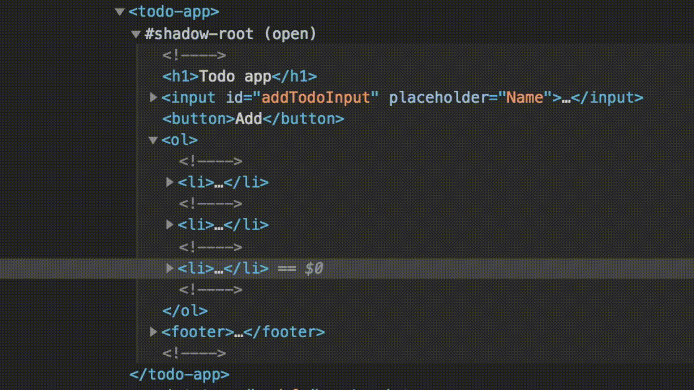

# Lit: basics

## Introduction

In this codelab, you will learn the basics of building web components using lit.

Lit is built out of two core packages:

[lit-html](https://github.com/lit/lit/tree/main/packages/lit-html) is an efficient, expressive and extensible HTML templating library for JavaScript. It lets you write HTML templates in JavaScript, then efficiently render and re-render those templates together with data to create and update DOM:

[lit-element](https://github.com/lit/lit/tree/main/packages/lit-element) is a simple base class for creating fast and lightweight web components with Lit.

**What you need**

- A recent version of Firefox, Safari, Chroome and Chromium-based browsers (Edge, Brave etc.)
- Intermediate knowledge of HTML and Javascript
- Familiarity with the following concepts:
  - [Javascript Modules](https://developer.mozilla.org/en-US/docs/Web/JavaScript/Guide/Modules)
  - [Arrow functions](https://developer.mozilla.org/en-US/docs/Web/JavaScript/Reference/Functions/Arrow_functions)
  - [Array filter](https://developer.mozilla.org/en-US/docs/Web/JavaScript/Reference/Global_Objects/Array/filter)
  - [Array map](https://developer.mozilla.org/en-US/docs/Web/JavaScript/Reference/Global_Objects/Array/map)
  - [Object & array spread](https://developer.mozilla.org/en-US/docs/Web/JavaScript/Reference/Operators/Spread_syntax)

**What you'll learn**

- Creating web components with lit
- Templating
- Repeating templates
- Conditional rendering
- Handling events
- Managing data
- Creating child components

**How it works**

This codelab will go step by step, explaining each code change. At the bottom of each section there is a "View final result" button, this will show you the correct code that you should end up with, incase you get stuck. The steps are sequential, thus results from the previous steps carry over to the next step.

## Setup

In this codelab, we will build a simple Todo app. This is a great exercise to learn the basics of Lit.

You can follow this codelab using anything that is able to display a simple HTML page. We recommend using an online code editor so that you don't need to bother with all the setup. But you can use a local editor as well.

All our examples are shown using Javascript, but Lit supports Typescript as well.

### Recommended setup

The code editor we recommend is [webcomponents.dev](https://webcomponents.dev/). You can use these links to quickly start a new project:

- [Lit with Javascript](https://studio.webcomponents.dev/create/lit+js)
- [Lit with Typescript](https://studio.webcomponents.dev/create/lit+ts)

If instead you are creating a new project from the website, make sure to select Lit from the "Libraries" section and not the "HTMLElement based" section.

### Other setup

If you are using another editor, you need to set up a basic `index.html` which loads your component:

```html
<!DOCTYPE html>
<html>
  <body>
    My app

    <!-- 
      this is a refernece in the HTML to your web component, 
      make sure to update it based on the name you have given your component 
    -->
    <my-app></my-app>

    <script type="module" src="./src/index.js"></script>
  </body>
</html>
```

To make following further instructions easier, it's recommended to write your JS code in a `src/index.js` file to match the webcomponents.dev setup.

## Code editor

<aside class="notice">
  The rest of this codelab assumes you are using the recommended setup using the webcomponents.dev editor.
  If you are using something else, you might need to take some additional or different steps to make it work.
</aside>

The webcomponents.dev editor creates a few files for you. We will be working only with `src/index.js` and `www/index.html`.

In `src/index.js` there is already some code with an example element. For the sake of this tutorial, let's empty this file and start over from scratch. We can leave the `www/index.html` file as is.

The editor shows three tabs on the right side of the screen. We will only be using the "Website" tab. Here you will see code changes reflected directly.

If you want, you could delete the `stories/index.stories.js` and `README.md` so that the other tabs disappear.

## Hello world

Now that we have set up our editor we will create our ToDo app element.

### Templating

Templating in Lit works by writing HTML inside of template literals. Template literals are a type of string which can span multiple lines, ideal for writing HTML:

```js
const template = `
  <h1>Hello world</h1>
`;
```

In order to create an actual Lit template, we need to prefix the template literal with a special HTML tag which we can import from the Lit library:

```js
import { html } from 'lit';

const template = html`<h1>Hello world</h1>`;
```

This is a native browser feature called [tagged template literals](https://developer.mozilla.org/en-US/docs/Web/JavaScript/Reference/Template_literals#Tagged_templates). The `html` tag is actually a function that gets called with information about the template literal that it's attached to. We won't go into too many details of how this works internally, but by using this syntax Lit can very efficiently create templates and update only the parts that changed when re-rendering.

<aside class="notice">
  Most popular IDEs support syntax highlighting of HTML inside template literals, but for some you might need to install a plugin. [See our IDE section](https://open-wc.org/developing/ide.html#visual-studio-code) to learn more about that.
</aside>

### Creating our element

To actually display a template on the screen we need to define a web component. A vanilla web component is created by defining a class which extends from the native `HTMLElement` class:

```js
class MyElement extends HTMLElement {}
```

Lit exposes a `LitElement` class which is itself an extension of the `HTMLElement` class, and adds useful functionality to make writing web components easier. Let's add this to our `index.js` file:

```js
import { LitElement } from 'lit';

class MyElement extends LitElement {}
```

LitElement exposes a `render()` method. This method is called each time there is an update to the element, and should return a Lit template.

When the template changes, Lit is able to efficiently figure out what changed and make only the minimum changes necessary to the DOM.

For now let's start with a static template to display the title of our app:

```js
import { html, LitElement } from 'lit';

class TodoApp extends LitElement {
  render() {
    return html`<h1>Todo app</h1>`;
  }
}
```

### Defining our element

After creating our web component class, we need to tell the browser about it. This is done by calling `customElements.define()` and passing our web component class, and the HTML tag name we want to associate with it.

Place this at the bottom of your index.js file:

```js
customElements.define('todo-app', TodoApp);
```

After defining your element, it's possible to display your web component **anywhere** where HTML is used. In static templates, from a CMS, in other web frameworks etc.

### Displaying our element

Now that we have defined our element, we need to display it on the page. This is done from the `www/index.html` file. This file is already set up mostly correctly. It loads our javascript from `dist/index.js`, because that's where `webcomponents.dev` makes our code available.

The only change we need to make is to the `<body>` section of the page. Here the name of the example element is still used. We should update it to instead show our Todo App:

```html
<body>
  <todo-app></todo-app>
</body>
```

The "website" tab on the right side should automatically update and show the `<h1>Todo app</h1>` rendered from your web component.

<details>
  <summary>View final result</summary>

`www/index.html`:

```html
<!DOCTYPE html>
<html>
  <head>
    <meta charset="UTF-8" />
    <script src="./dist/index.js" type="module"></script>
  </head>

  <body>
    <todo-app></todo-app>
  </body>
</html>
```

`src/index.js`:

```js
import { html, LitElement } from 'lit';

class TodoApp extends LitElement {
  render() {
    return html`<h1>Todo app</h1>`;
  }
}

customElements.define('todo-app', TodoApp);
```

</details>

## Templating basics

Templates are javascript variables, and can be created and composed like other variables.

We can also create them outside of our component's context. A good example of this is when you want to share pieces of a template between different components.

Let's add a footer to our application. First, let's create the template for the footer:

```js
const footerTemplate = html`
  <footer>Made with love by <a href="https://open-wc.org/">open-wc</a></footer>
`;
```

You can add your own name and website in there as author.

Template literals can contain placeholders. These are indicated by a dollar sign with curly braces: `${expression}`.

<aside class="notice">
  Template literals are often used when building error messages:

```js
// regular string
console.error('An error occurred: ' + message);
// template literal
console.error(`An error occurred: ${message}`);
```

</aside>

Lit takes advantage of this feature in order to compose templates and to create dynamic parts inside your templates. For example, we can add the footer to our app's template by simply embedding it:

```js
class TodoApp extends LitElement {
  render() {
    return html`
      <h1>Todo app</h1>

      ${footerTemplate}
    `;
  }
}
```

You should now see both the app's title and footer on the page.

Lit supports embedding different types of variables. In the example above, we embedded a template inside of another template, but we can also embed strings inside of a template. Let's extract the link text to a separate variable and then embed it in the template:

```js
const author = 'open-wc';
const footerTemplate = html`
  <footer>Made with love by <a href="https://open-wc.org/">${author}</a></footer>
`;
```

We can also extract the link to a separate variable, and set the href attribute with a variable:

```js
const author = 'open-wc';
const homepage = 'https://open-wc.org/';
const footerTemplate = html`
  <footer>Made with love by <a href="${homepage}">${author}</a></footer>
`;
```

When embedding variables like this, Lit remembers which parts of your template are static and which parts are dynamic. When re-rendering the same template you can change the value of these variables and Lit will know to only update the parts that changed. This makes it very efficient!

<aside class="notice">
It's important to keep in mind that whatever you're writing must still be valid HTML and you cannot arbitrarily concatenate strings to build HTML. This is important to enable efficient updates, as well as for security to protect you from XSS attacks.

For example you cannot set tagnames or attribute keys dynamically:

```js
const attributes = `href="https://open-wc.org/"`;
const tagname = 'footer';
// this does not work
const footerTemplate = html`
  <${tagname}>
    Made with love by <a ${attributes}></a>
  </${tagname}>
`;
```

</aside>

<details>
  <summary>View final result</summary>

`src/index.js`:

```js
import { LitElement, html } from 'lit';

const author = 'open-wc';
const homepage = 'https://open-wc.org/';
const footerTemplate = html`
  <footer>Made with love by <a href="${homepage}">${author}</a></footer>
`;

class TodoApp extends LitElement {
  render() {
    return html`
      <h1>Todo app</h1>

      ${footerTemplate}
    `;
  }
}

customElements.define('todo-app', TodoApp);
```

</details>

## Displaying todos

Now that you know how to compose templates with Lit, we can start adding a list of todos to our application.

Let's start by creating an array of todos in the constructor of our component:

```js
class TodoApp extends LitElement {
  constructor() {
    super();
    this.todos = ['Do A', 'Do B', 'Do C'];
  }
}
```

We can render this array directly inside the template of our application:

```js
render() {
  return html`
    <h1>Todo app</h1>

    ${this.todos} ${footerTemplate}
  `;
}
```

When you pass an array to Lit, it will just iterate and render what's inside it. In this case, it will render the list of todos as plain text.

Just displaying text is not what we want though, we need something more complex. This is where we can combine two capabilities of Lit: iterating arrays and rendering nested templates. If we turn our array of strings to an array of templates, we can render HTML for each of our todos.

A great way to accomplish this is through a map function. Let's create an ordered list of todos:

```js
render() {
  return html`
    <h1>Todo app</h1>

    <ol>
      ${this.todos.map(
        todo => html`
          <li>${todo}</li>
        `,
      )}
    </ol>

    ${footerTemplate}
  `;
}
```

Apart from displaying the text of a todo item, we need to indicate whether the todo item is finished or not.

Let's update our data structure from strings to objects and display the finished state on the screen:

```js
this.todos = [
  { text: 'Do A', finished: true },
  { text: 'Do B', finished: false },
  { text: 'Do C', finished: false },
];
```

```js
render() {
  return html`
    <h1>Todo app</h1>

    <ol>
      ${this.todos.map(
        todo => html`
          <li>${todo.text} (${todo.finished ? 'Finished' : 'Unfinished'})</li>
        `,
      )}
    </ol>

    ${footerTemplate}
  `;
}
```

Because template literals allow us to place any expression inside of the curly braces, we can use ternary operators for quick and easy conditional logic.

You should now see three todo items on the screen, where the first one is already finished.

<details>
  <summary>View final result</summary>

`src/index.js`:

```js
import { LitElement, html } from 'lit';

const author = 'open-wc';
const homepage = 'https://open-wc.org/';
const footerTemplate = html`
  <footer>Made with love by <a href="${homepage}">${author}</a></footer>
`;

class TodoApp extends LitElement {
  constructor() {
    super();
    this.todos = [
      { text: 'Do A', finished: true },
      { text: 'Do B', finished: false },
      { text: 'Do C', finished: false },
    ];
  }

  render() {
    return html`
      <h1>Todo app</h1>

      <ol>
        ${this.todos.map(
          todo => html` <li>${todo.text} (${todo.finished ? 'Finished' : 'Unfinished'})</li> `,
        )}
      </ol>

      ${footerTemplate}
    `;
  }
}

customElements.define('todo-app', TodoApp);
```

</details>

## Adding a todo

Now, we will add the ability to add todos to our list.

Start by adding an input field and a button:

```html
<h1>Todo app</h1>

<input id="addTodoInput" placeholder="Name" />
<button @click="${this._addTodo}">Add</button>

<ol>
  ...
</ol>
```

On the "add" button we attached an event listener that listens for the `click` event. This is done by prefixing the event name with a `@` and attributing a function to it.

```js
html` <button @click=${this._addTodo}></button> `;
```

This is just syntactic sugar that executes the `addEventListener()` function on the element with the specified event and function. In this case, we reference a function of our component, which we should now implement:

```js
_addTodo() {
  const input = this.shadowRoot.getElementById('addTodoInput');
  const text = input.value;
  input.value = '';

  this.todos.push({ text, finished: false });
  this.requestUpdate();
}
```

When this event handler is called, we create a new todo item and add it to the array of todos. Next we need to trigger a re-render so that we can display the new todo item on the screen. We can do this by calling the `requestUpdate` method which exists on any element that extends from the `LitElement` class.

When you click add, you should see the new element appear on the screen.

This allows us to observe the awesome power of Lit in action. If you inspect the DOM while adding a new todo item, you will notice that only the new todo item is flashing:



When something in the DOM inspector flashes, it means that the browser is doing actual work to update the DOM tree. This is very expensive, things like the styles and layout need to be recalculated up and down the element tree, so it is wise to minimize this as much as possible. Lit knows exactly what changed where and it will update only that part, making it super efficient.

<aside class="notice">
In the inspector you also see comment nodes between different parts of your template. These are markers created by Lit to track the locations of DOM nodes, they can be ignored safely.
</aside>

<details>
  <summary>View final result</summary>

`src/index.js`:

```js
import { LitElement, html } from 'lit';

const author = 'open-wc';
const homepage = 'https://open-wc.org/';
const footerTemplate = html`
  <footer>Made with love by <a href="${homepage}">${author}</a></footer>
`;

class TodoApp extends LitElement {
  constructor() {
    super();
    this.todos = [
      { text: 'Do A', finished: true },
      { text: 'Do B', finished: false },
      { text: 'Do C', finished: false },
    ];
  }

  render() {
    return html`
      <h1>Todo app</h1>

      <input id="addTodoInput" placeholder="Name" />
      <button @click=${this._addTodo}>Add</button>

      <ol>
        ${this.todos.map(
          todo => html` <li>${todo.text} (${todo.finished ? 'Finished' : 'Unfinished'})</li> `,
        )}
      </ol>

      ${footerTemplate}
    `;
  }

  _addTodo() {
    const input = this.shadowRoot.getElementById('addTodoInput');
    const text = input.value;
    input.value = '';

    this.todos.push({ text, finished: false });
    this.requestUpdate();
  }
}

customElements.define('todo-app', TodoApp);
```

</details>

## Reactive property changes

Right now, we're triggering updates manually whenever we make a change. This is fine for some use cases, but it can get pretty cumbersome and we are not able to respond to changes triggered by parent components.

It's better to let `LitElement` observe data changes for us and, trigger updates when necessary. We can do this by defining `todos` as a property of our element.

Start by adding a static properties field, and add `todos` as an array property:

```js
static properties = {
  todos: { type: Array }
};
```

For each property that you've defined, `LitElement` generates something similar to this:

```js
class TodosApp extends LitElement {
  set todos(newTodos) {
    if (this._todos === newTodos) {
      // no change, don't do any work
      return;
    }

    // value changed, trigger an update
    this._todos = newTodos;
    this.requestUpdate();
  }

  get todos() {
    return this._todos;
  }
}
```

This way when you change the property on your element, it goes through a custom getter/setter function which triggers an update only when the new value passes a simple equality check.

For strings, numbers and booleans this will work without any problems. However, if you are using arrays or objects and mutate them, it will not trigger any update. This is because the actual array or object itself did not change. We need to use immutable data patterns, where a new object is created for each change. This is a common pattern in front-end to simplify data flow and make change detection easier.

In our case we are using Array's `push()` function, which mutates the existing `this.todos` array. In order to use an immutable data pattern, instead, we can copy the existing list of todos using array spread, add our new todo and assign it back to `this.todos`:

```js
_addTodo() {
  const input = this.shadowRoot.getElementById('addTodoInput');
  const text = input.value;
  input.value = '';

  this.todos = [
    ...this.todos,
    { text, finished: false },
  ];
}
```

The list should now still update like before.

<details>
  <summary>View final result</summary>

```js
import { LitElement, html } from 'lit';

const author = 'open-wc';
const homepage = 'https://open-wc.org/';
const footerTemplate = html`
  <footer>Made with love by <a href="${homepage}">${author}</a></footer>
`;

class TodoApp extends LitElement {
  static properties = {
    todos: { type: Array },
  };

  constructor() {
    super();
    this.todos = [
      { text: 'Do A', finished: true },
      { text: 'Do B', finished: false },
      { text: 'Do C', finished: false },
    ];
  }

  render() {
    return html`
      <h1>Todo app</h1>

      <input id="addTodoInput" placeholder="Name" />
      <button @click=${this._addTodo}>Add</button>

      <ol>
        ${this.todos.map(
          todo => html` <li>${todo.text} (${todo.finished ? 'Finished' : 'Unfinished'})</li> `,
        )}
      </ol>

      ${footerTemplate}
    `;
  }

  _addTodo() {
    const input = this.shadowRoot.getElementById('addTodoInput');
    const text = input.value;
    input.value = '';

    this.todos = [...this.todos, { text, finished: false }];
  }
}

customElements.define('todo-app', TodoApp);
```

</details>

## Deleting a todo

If we make a mistake, we want to be able to remove a todo item from the list.

Let's add a delete button to the template of a todo item:

```html
<ol>
  ${this.todos.map( todo => html`
  <li>
    ${todo.text} (${todo.finished ? 'Finished' : 'Unfinished'})
    <button @click="${()" ="">this._removeTodo(todo)}>X</button>
  </li>
  `, )}
</ol>
```

We need to pass along the item we want to delete to the event handler, so instead of referencing the method directly we are using an arrow function and we call it with the item of the current iteration of our map function.

Next, we add the event handler which deletes the todo item:

```js
_removeTodo(todo) {
  this.todos = this.todos.filter(e => e !== todo);
}
```

The delete button should now be fully functional. In this function as well, we assign a new array to `this.todos` as `filter()` returns a new array. `LitElement` will automatically detect the new array and re-render our component.

<details>
  <summary>View final result</summary>

```js
import { LitElement, html } from 'lit';

const author = 'open-wc';
const homepage = 'https://open-wc.org/';
const footerTemplate = html`
  <footer>Made with love by <a href="${homepage}">${author}</a></footer>
`;

class TodoApp extends LitElement {
  static properties = {
    todos: { type: Array },
  };

  constructor() {
    super();
    this.todos = [
      { text: 'Do A', finished: true },
      { text: 'Do B', finished: false },
      { text: 'Do C', finished: false },
    ];
  }

  render() {
    return html`
      <h1>Todo app</h1>

      <input id="addTodoInput" placeholder="Name" />
      <button @click=${this._addTodo}>Add</button>

      <ol>
        ${this.todos.map(
          todo => html`
            <li>
              ${todo.text} (${todo.finished ? 'Finished' : 'Unfinished'})
              <button @click=${() => this._removeTodo(todo)}>X</button>
            </li>
          `,
        )}
      </ol>

      ${footerTemplate}
    `;
  }

  _addTodo() {
    const input = this.shadowRoot.getElementById('addTodoInput');
    const text = input.value;
    input.value = '';

    this.todos = [...this.todos, { text, finished: false }];
  }

  _removeTodo(todo) {
    this.todos = this.todos.filter(e => e !== todo);
  }
}

customElements.define('todo-app', TodoApp);
```

</details>

## Finishing a todo

A todo list is useless if we can't keep track of which todos we've finished, and which todos we have not. What we need is a way to manage its state.

First, let's replace our finished/unfinished text with a checkbox:

```html
<li>
  <input type="checkbox" .checked="${todo.finished}" @change="${e" ="" />
  this._changeTodoFinished(e, todo)} /> ${todo.text}
  <button @click="${()" ="">this._removeTodo(todo)}>X</button>
</li>
```

Notice that we prefixed the `checked` attribute on the checkbox with a `.`. This is special Lit syntax to specifiy we want to set the property named `checked` instead of the attribute named `checked`.

<aside class="notice">
Attributes are how we can assign (string) data in the HTML representation of an element:

```html
<input value="foo" />
```

Properties are how we can assign data in javascript, on the actual DOM element in Javascript:

```js
const input = /* get a reference to the input element */;
input.value = 'foo';
```

We can also access or set attribute data in Javascript.

```js
const input = /* get a reference to the input element */;
input.setAttribute('value', 'foo');
```

The concept of attributes and properties of a HTML element confuses a lot of people, as it is sometimes thought to represent the same data and to be interchangeable. It's up to each element on how (and if) to keep the value of properties and attributes in sync. A common practice is to sync changes to an attribute to a property of the same name but not to reflect changes to properties to an attribute of the same name.

</aside>

We're listening to the input's `change` event to update our data when the checkbox value is changed. Besides the todo object, we are also passing along the event object itself. We need this to be able to get the value of the checkbox.

In the event handler, we can use the `map()` function to update the finished property of our todo:

```js
_changeTodoFinished(e, changedTodo) {
  const finished = e.target.checked;

  this.todos = this.todos.map((todo) => {
    if (todo !== changedTodo) {
      return todo;
    }
    return { ...changedTodo, finished };
  });
}
```

<details>
  <summary>View final result</summary>

```js
import { LitElement, html } from 'lit';

const author = 'open-wc';
const homepage = 'https://open-wc.org/';
const footerTemplate = html`
  <footer>Made with love by <a href="${homepage}">${author}</a></footer>
`;

class TodoApp extends LitElement {
  static properties = {
    todos: { type: Array },
  };

  constructor() {
    super();
    this.todos = [
      { text: 'Do A', finished: true },
      { text: 'Do B', finished: false },
      { text: 'Do C', finished: false },
    ];
  }

  render() {
    return html`
      <h1>Todo app</h1>

      <input id="addTodoInput" placeholder="Name" />
      <button @click=${this._addTodo}>Add</button>

      <ol>
        ${this.todos.map(
          todo => html`
            <li>
              <input
                type="checkbox"
                .checked=${todo.finished}
                @change=${e => this._changeTodoFinished(e, todo)}
              />
              ${todo.text}
              <button @click=${() => this._removeTodo(todo)}>X</button>
            </li>
          `,
        )}
      </ol>

      ${footerTemplate}
    `;
  }

  _addTodo() {
    const input = this.shadowRoot.getElementById('addTodoInput');
    const text = input.value;
    input.value = '';

    this.todos = [...this.todos, { text, finished: false }];
  }

  _removeTodo(todo) {
    this.todos = this.todos.filter(e => e !== todo);
  }

  _changeTodoFinished(e, changedTodo) {
    const finished = e.target.checked;

    this.todos = this.todos.map(todo => {
      if (todo !== changedTodo) {
        return todo;
      }
      return { ...changedTodo, finished };
    });
  }
}

customElements.define('todo-app', TodoApp);
```

</details>

## Displaying totals

Now that we can manage our todo items, it's pretty easy to display some more information about our list. For example, we can add the total amount of finished and unfinished items.

These are not new sources of data, but rather a simple calculation based on existing data. We could do these calculations inline in our template where we want to display them, but this can get messy, pretty quickly.

Good practice is to use the top of your render function as a place to prepare variables with some meaningful names to use them in your template. This provides the best readability.

Let's add our calculations to the render function, and display the calculated amounts in the template:

```js
render() {
  const finishedCount = this.todos.filter(e => e.finished).length;
  const unfinishedCount = this.todos.length - finishedCount;

  return html`
    <h1>Todo app</h1>

    <input id="addTodoInput" placeholder="Name" />
    <button @click=${this._addTodo}>Add</button>

    <ol>
    ...
    </ol>

    <div>Total finished: ${finishedCount}</div>
    <div>Total unfinished: ${unfinishedCount}</div>

    ${footerTemplate}
  `;
}
```

Remember that the `render()` function can be called quite often. If the computations are expensive, it's better to only do them once and cache the results.

<details>
  <summary>View final result</summary>

```js
import { LitElement, html } from 'lit';

const author = 'open-wc';
const homepage = 'https://open-wc.org/';
const footerTemplate = html`
  <footer>Made with love by <a href="${homepage}">${author}</a></footer>
`;

class TodoApp extends LitElement {
  static properties = {
    todos: { type: Array },
  };

  constructor() {
    super();
    this.todos = [
      { text: 'Do A', finished: true },
      { text: 'Do B', finished: false },
      { text: 'Do C', finished: false },
    ];
  }

  render() {
    const finishedCount = this.todos.filter(e => e.finished).length;
    const unfinishedCount = this.todos.length - finishedCount;

    return html`
      <h1>Todo app</h1>

      <input id="addTodoInput" placeholder="Name" />
      <button @click=${this._addTodo}>Add</button>

      <ol>
        ${this.todos.map(
          todo => html`
            <li>
              <input
                type="checkbox"
                .checked=${todo.finished}
                @change=${e => this._changeTodoFinished(e, todo)}
              />
              ${todo.text}
              <button @click=${() => this._removeTodo(todo)}>X</button>
            </li>
          `,
        )}
      </ol>

      <div>Total finished: ${finishedCount}</div>
      <div>Total unfinished: ${unfinishedCount}</div>

      ${footerTemplate}
    `;
  }

  _addTodo() {
    const input = this.shadowRoot.getElementById('addTodoInput');
    const text = input.value;
    input.value = '';

    this.todos = [...this.todos, { text, finished: false }];
  }

  _removeTodo(todo) {
    this.todos = this.todos.filter(e => e !== todo);
  }

  _changeTodoFinished(e, changedTodo) {
    const finished = e.target.checked;

    this.todos = this.todos.map(todo => {
      if (todo !== changedTodo) {
        return todo;
      }
      return { ...changedTodo, finished };
    });
  }
}

customElements.define('todo-app', TodoApp);
```

</details>

## Create a child component

It looks like we're feature complete! We can display a list of todos, add or remove them and check them off once completed.

However, we've been putting everything inside only one component, and it's starting to get crowded. It's better to split functionality up into separate components. We are building Web Components, after all.

The todo list is an ideal candidate to be moved into a separate component. Let's go ahead and define the basic structure of our element. If you're working in an online editor, it's probably easier to do this in the same file. If you're using a local editor, it's best to create a separate file for this.

If you use a separate file, don't forget to import `LitElement` and `html` for that module as well.

```js
class TodoList extends LitElement {
  static properties = {
    todos: { type: Array },
  };

  render() {
    if (!this.todos) {
      return html``;
    }

    return html`
      <ol>
        ${this.todos.map(
          todo => html`
            <li>
              <input
                type="checkbox"
                .checked=${todo.finished}
                @change=${e => this._changeTodoFinished(e, todo)}
              />
              ${todo.text}
              <button @click=${() => this._removeTodo(todo)}>X</button>
            </li>
          `,
        )}
      </ol>
    `;
  }
}

customElements.define('todo-list', TodoList);
```

The structure of the class should be pretty familiar by now. It has a `todos` property and a template to render. The `render()` function looks similar as before, except that there is an `if` condition now at the top of the function. We need this because, unlike before, our todo list is not in charge of the data anymore.

The parent element is still in charge, and we expect that it will pass along the todos list to this component. This means that we can't assume that the list will always be there when rendered. If we don't take care of this, our component will crash because you can't run a `map` function on `undefined`. Adding an early return to the render function is a simple way to do this. It makes it easy to see which properties are required for rendering.

Next, we need to somehow let the parent element know that the user clicked on the checkbox or the remove button. We can do this by using DOM events. DOM events are great because the structure and hierarchy of our application is reflected in the DOM. When an event gets fired on a component, only parent components up the DOM tree can receive it. This behavior allows our communication system to be automatically scoped.

Let's add the events that we want to fire:

```js
_changeTodoFinished(e, changedTodo) {
  const eventDetails = { changedTodo, finished: e.target.checked };
  this.dispatchEvent(new CustomEvent('change-todo-finished', { detail: eventDetails }));
}

_removeTodo(item) {
  this.dispatchEvent(new CustomEvent('remove-todo', { detail: item }));
}
```

The next step will be to actually use the new child component. We will need to pass on the appropriate data and listen to the events fired by the child.

<details>
  <summary>View final result</summary>

```js
import { LitElement, html } from 'lit';

class TodoList extends LitElement {
  static properties = {
    todos: { type: Array },
  };

  render() {
    if (!this.todos) {
      return html``;
    }

    return html`
      <ol>
        ${this.todos.map(
          todo => html`
            <li>
              <input
                type="checkbox"
                .checked=${todo.finished}
                @change=${e => this._changeTodoFinished(e, todo)}
              />
              ${todo.text}
              <button @click=${() => this._removeTodo(todo)}>X</button>
            </li>
          `,
        )}
      </ol>
    `;
  }

  _changeTodoFinished(e, changedTodo) {
    const eventDetails = { changedTodo, finished: e.target.checked };
    this.dispatchEvent(new CustomEvent('change-todo-finished', { detail: eventDetails }));
  }

  _removeTodo(item) {
    this.dispatchEvent(new CustomEvent('remove-todo', { detail: item }));
  }
}

customElements.define('todo-list', TodoList);

const author = 'open-wc';
const homepage = 'https://open-wc.org/';
const footerTemplate = html`
  <footer>Made with love by <a href="${homepage}">${author}</a></footer>
`;

class TodoApp extends LitElement {
  static properties = {
    todos: { type: Array },
  };

  constructor() {
    super();
    this.todos = [
      { text: 'Do A', finished: true },
      { text: 'Do B', finished: false },
      { text: 'Do C', finished: false },
    ];
  }

  render() {
    const finishedCount = this.todos.filter(e => e.finished).length;
    const unfinishedCount = this.todos.length - finishedCount;

    return html`
      <h1>Todo app</h1>

      <input id="addTodoInput" placeholder="Name" />
      <button @click=${this._addTodo}>Add</button>

      <ol>
        ${this.todos.map(
          todo => html`
            <li>
              <input
                type="checkbox"
                .checked=${todo.finished}
                @change=${e => this._changeTodoFinished(e, todo)}
              />
              ${todo.text}
              <button @click=${() => this._removeTodo(todo)}>X</button>
            </li>
          `,
        )}
      </ol>

      <div>Total finished: ${finishedCount}</div>
      <div>Total unfinished: ${unfinishedCount}</div>

      ${footerTemplate}
    `;
  }

  _addTodo() {
    const input = this.shadowRoot.getElementById('addTodoInput');
    const text = input.value;
    input.value = '';

    this.todos = [...this.todos, { text, finished: false }];
  }

  _removeTodo(todo) {
    this.todos = this.todos.filter(e => e !== todo);
  }

  _changeTodoFinished(e, changedTodo) {
    const finished = e.target.checked;

    this.todos = this.todos.map(todo => {
      if (todo !== changedTodo) {
        return todo;
      }
      return { ...changedTodo, finished };
    });
  }
}

customElements.define('todo-app', TodoApp);
```

</details>

## Implement a child element

Now that we've created our child element, we need to implement it in the parent element. If you created your child element in a separate file, you will need to import it in the parent element:

```js
import './todos-list.js';
```

Some online editors automatically include separate files.

To render our child component, we simply replace the existing template with the tag of the child component:

```js
render() {
  const finishedCount = this.todos.filter(e => e.finished).length;
  const unfinishedCount = this.todos.length - finishedCount;

  return html`
    <h1>Todo app</h1>

    <input id="addTodoInput" placeholder="Name" />
    <button @click=${this._addTodo}>Add</button>

    <todo-list .todos=${this.todos}></todo-list>

    <div>Total finished: ${finishedCount}</div>
    <div>Total unfinished: ${unfinishedCount}</div>

    ${footerTemplate}
  `;
}
```

If you refresh, the UI should remain unchanged. If that is the case, congratulations! You're now composing elements like a pro. :)

Notice that we are again using the property syntax to pass on the data in `this.todo` to the `<todo-list>` element.

Next, we need to listen to the new events of `<todo-list>`:

```html
<todo-list
  .todos="${this.todos}"
  @change-todo-finished="${this._changeTodoFinished}"
  @remove-todo="${this._removeTodo}"
></todo-list>
```

The events are calling the existing methods that we already have defined in our element. However, we will need to update the event handlers slightly to handle these new events:

```js
_removeTodo(e) {
  this.todos = this.todos.filter(todo => todo !== e.detail);
}

_changeTodoFinished(e) {
  const { changedTodo, finished } = e.detail;

  this.todos = this.todos.map((todo) => {
    if (todo !== changedTodo) {
      return todo;
    }
    return { ...changedTodo, finished };
  });
}
```

After this, your application should work just like before, but the code is not as spread out anymore.

## Styling

We've covered the basics of templating and managing data with lit-element. The last remaining topic we need to look into is styling. This isn't a codelab on CSS, so we will only look at some of the specifics of working with styling in lit-element.

For styling, lit-element uses Shadow DOM. If you're not familiar with Shadow DOM, I recommend following the [web component basics](https://open-wc.org/codelabs/basics/web-components.html) codelab.

To define the styles of your element we need to import the `css` tag and add a static styles property on our element. Let's add styles to the todo list:

```js
import { LitElement, css } from 'lit';

class TodoList extends LitElement {
  static properties = {
    todos: { type: Array },
  };

  static styles = css`
    :host {
      color: blue;
    }

    ul {
      list-style: none;
      padding: 0;
    }

    button {
      background-color: transparent;
      border: none;
    }
  `;

  render() {
    if (!this.todos) {
      return html``;
    }

    return html`
      <ol>
        ${this.todos.map(
          todo => html`
            <li>
              <input
                type="checkbox"
                .checked=${todo.finished}
                @change=${e => this._changeTodoFinished(e, todo)}
              />
              ${todo.text}
              <button @click=${() => this._removeTodo(todo)}>X</button>
            </li>
          `,
        )}
      </ol>
    `;
  }
}

customElements.define('todo-list', TodoList);
```

The styles we define here only apply to our element. This is because we're using Shadow DOM. Lit-element doesn't need to do any extra work. This means we can write simple CSS selectors, and we don't need to worry about causing conflicts with styles defined elsewhere in the page.

<aside class="notice">
<code>:host</code> is a special selector, which selects the host of the shadow root that these styles are associated with. In our case that's our own custom element.
</aside>

<details>
  <summary>View final result</summary>

```js
import { LitElement, html, css } from 'lit';

class TodoList extends LitElement {
  static properties = {
    todos: { type: Array },
  };

  static styles = css`
    :host {
      color: blue;
    }

    ul {
      list-style: none;
      padding: 0;
    }

    button {
      background-color: transparent;
      border: none;
    }
  `;

  render() {
    if (!this.todos) {
      return html``;
    }

    return html`
      <ol>
        ${this.todos.map(
          todo => html`
            <li>
              <input
                type="checkbox"
                .checked=${todo.finished}
                @change=${e => this._changeTodoFinished(e, todo)}
              />
              ${todo.text}
              <button @click=${() => this._removeTodo(todo)}>X</button>
            </li>
          `,
        )}
      </ol>
    `;
  }

  _changeTodoFinished(e, changedTodo) {
    const eventDetails = { changedTodo, finished: e.target.checked };
    this.dispatchEvent(new CustomEvent('change-todo-finished', { detail: eventDetails }));
  }

  _removeTodo(item) {
    this.dispatchEvent(new CustomEvent('remove-todo', { detail: item }));
  }
}

customElements.define('todo-list', TodoList);

const author = 'open-wc';
const homepage = 'https://open-wc.org/';
const footerTemplate = html`
  <footer>Made with love by <a href="${homepage}">${author}</a></footer>
`;

class TodoApp extends LitElement {
  static properties = {
    todos: { type: Array },
  };

  constructor() {
    super();
    this.todos = [
      { text: 'Do A', finished: true },
      { text: 'Do B', finished: false },
      { text: 'Do C', finished: false },
    ];
  }

  render() {
    const finishedCount = this.todos.filter(e => e.finished).length;
    const unfinishedCount = this.todos.length - finishedCount;

    return html`
      <h1>Todo app</h1>

      <input id="addTodoInput" placeholder="Name" />
      <button @click=${this._addTodo}>Add</button>

      <todo-list
        .todos=${this.todos}
        @change-todo-finished=${this._changeTodoFinished}
        @remove-todo=${this._removeTodo}
      ></todo-list>

      <div>Total finished: ${finishedCount}</div>
      <div>Total unfinished: ${unfinishedCount}</div>

      ${footerTemplate}
    `;
  }

  _addTodo() {
    const input = this.shadowRoot.getElementById('addTodoInput');
    const text = input.value;
    input.value = '';

    this.todos = [...this.todos, { text, finished: false }];
  }

  _removeTodo(e) {
    this.todos = this.todos.filter(todo => todo !== e.detail);
  }

  _changeTodoFinished(e) {
    const { changedTodo, finished } = e.detail;

    this.todos = this.todos.map(todo => {
      if (todo !== changedTodo) {
        return todo;
      }
      return { ...changedTodo, finished };
    });
  }
}

customElements.define('todo-app', TodoApp);
```

</details>

## Wrapping up

And that's it! We've gone through the basics of lit-element and Lit. Hopefully from here onwards you will be able to move forward working with lit-element and Lit with confidence.

If you're eager to learn more, you can take a look at the following resources:

- [Lit official docs](https://Lit.polymer-project.org/)
- [lit-element official docs](https://lit-element.polymer-project.org/)
- [open-wc code samples](https://open-wc.org/developing/code-examples.html)
- [IDE help](https://open-wc.org/developing/ide.html)

To get started with your own project we recommend using open-wc's project scaffolding, it's easy to set it up using this command:

```bash
npm init @open-wc
```
