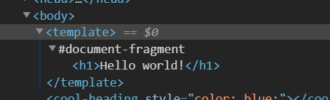
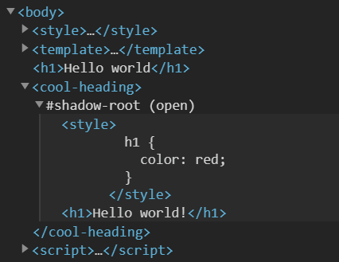
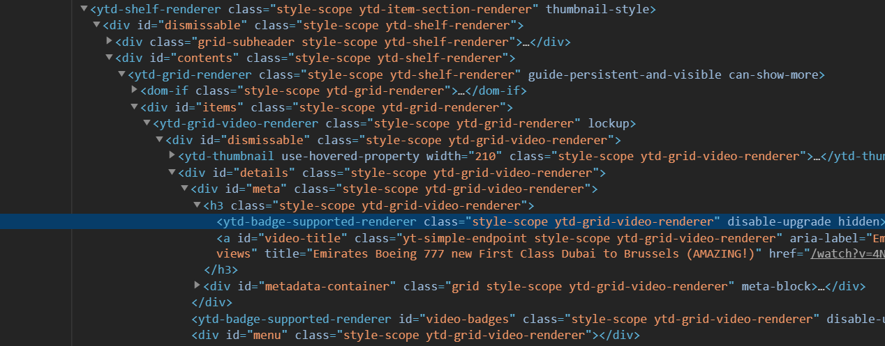
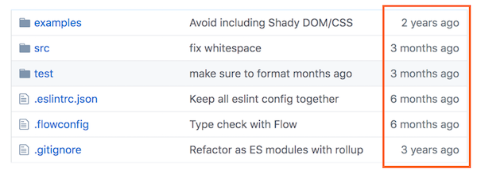
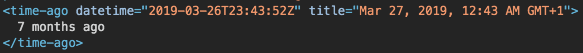
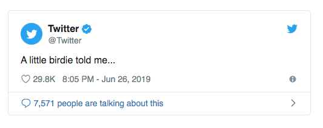
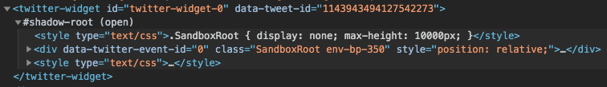
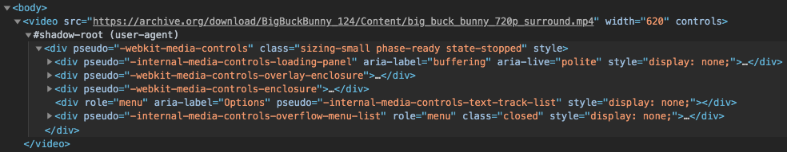

# Web Components basics

## Introduction

In this codelab, you will learn about the basics of web components and how they work.

Web components are a set of low-level browser features that allow us to write modular, encapsulated and reusable HTML elements. Web components are based on web standards and work in any environment that supports basic HTML and JavaScript. This means that there is no complex setup required for you to get started.

Web components align with the way that browsers have always worked, they are pretty low level and straightforward. For most projects you will still want to use libraries or frameworks. But instead of each framework developing their own component model, they can use the features that are already baked into the browser.

Web components are quite flexible and have a multitude of possible use cases. The more prominent use case is to build reusable UI components. This is especially powerful, for the reason that UI components can be reused in applications that are built with different technologies.

Furthermore, web components can also be used to compose entire applications and are also a perfect fit for static/server-rendered pages where the components just add interactivity after the initial render.

**What you need**

- A web browser that supports Web Components: Firefox, Safari, Chrome or any Chromium-based browser.
- Basic knowledge of HTML, CSS, and Javascript.

**What you'll learn**

Browsers are moving pretty fast, and new features and APIs are being added all the time. In this codelab you will learn about the three main browser features that Web Components consist of:

- Custom Elements
- Templates
- Shadow DOM

**How it works**

This codelab will take you through web components step by step, explaining each section as you go along. At the bottom of each section, there is a "View final result" button. This will show you the correct code that you should end up with in case you get stuck. The steps are sequential, thus results from the previous steps carry over to the next step.

## Setup

You can follow this codelab using anything that is able to display a simple HTML page. We recommend using an [online code editor like jsbin](https://jsbin.com/?html,output), but you can also create your own HTML page using your favorite IDE.

To get started, let's create a basic HTML page:

```html
<!DOCTYPE html>

<html>
  <body>
    <h1>Hello world!</h1>
  </body>
</html>
```

If you run this in the browser and see hello world, you're good to go!

## Custom Elements

First, we will take a look at the most important web component browser feature: Custom Elements.

Modify your HTML to wrap the "Hello world" message in an element called `<cool-heading>`:

```html
<cool-heading>
  <h1>Hello world!</h1>
</cool-heading>
```

Currently, your browser does not recognize the `<cool-heading>` tag. When the browser encounters an unknown HTML tag like `<cool-heading>`, it will just render it as an inline element and move on. With the custom elements API, we can tell the browser what to do with the HTML tag that we have just created.

We need to do this in javascript, so let's add a script tag to the bottom of our `<body>` element:

```html
<script>
  // your code will go here
</script>
```

To create a custom element we need to declare a class that extends the `HTMLElement` class. This is the base class that powers all other native elements such as the `<input>` and `<button>` elements. Now, let's go ahead and create a new class for our `<cool-heading>` element:

```js
class CoolHeading extends HTMLElement {
  connectedCallback() {
    console.log('cool heading connected!');
  }
}
```

After creating our class we can associate it with a tagname by defining it in the custom elements registry. This way, whenever the browser's parser gets to the `<cool-heading>` tag, it will instantiate and apply our class to that specific element:

```js
customElements.define('cool-heading', CoolHeading);
```

<details>
  <summary>
    View final result
  </summary>

```html
<!DOCTYPE html>

<html>
  <body>
    <cool-heading>
      <h1>Hello world!</h1>
    </cool-heading>

    <script>
      class CoolHeading extends HTMLElement {
        connectedCallback() {
          console.log('cool heading connected!');
        }
      }

      customElements.define('cool-heading', CoolHeading);
    </script>
  </body>
</html>
```

</details>

## Customizing our element

<aside class="notice">
  We show examples using imperative DOM manipulation to make it easy to understand the basics. Unless you are building super portable components, you will likely use some helper libraries for templating/rendering. Don't worry, we will look into that later in the codelab.
</aside>

In the previous step, you learned how to set up a basic custom element. Now it's time to actually make it do something useful.

When the browser instantiates our custom element it triggers some lifecycle callbacks. For now, the only lifecycle methods that we are going to learn about are `connectedCallback()` and `disconnectedCallback()` as seen below:

```js
class MyElement extends HTMLElement {
  constructor() {
    super();
    // called when the class is instantiated (standard js)
  }

  connectedCallback() {
    /**
     * called when the element is connected to the page
     * this can be called multiple times during the element's lifecycle
     * for example when using drag&drop to move elements around
     */
  }

  disconnectedCallback() {
    // called when the element is disconnected from the page
  }
}
```

Because our element extends from the `HTMLElement` class, when it gets instantiated, the class instance is an actual live DOM element. All the methods and properties we are familiar with from a regular DOM element exist here as well.

For example, let's add some styles to our element:

```js
class CoolHeading extends HTMLElement {
  connectedCallback() {
    this.style.color = 'blue';
  }
}
```

The text in our element should now appear blue.

To respond to user input, we can add an event listener to our element or one of its children. Let's add one that will change the color of the element when clicked:

```js
class CoolHeading extends HTMLElement {
  constructor() {
    super();

    this.addEventListener('click', () => {
      this.style.color = 'red';
    });
  }

  connectedCallback() {
    this.style.color = 'blue';
  }
}
```

<aside class="notice">
We're adding the event listener in the constructor, because the <code>connectedCallback()</code> method can be called multiple times during the lifecycle of our element, for example when using drag and drop, or when an element is disconnected from one location and connected again in another. That would cause the event listener to be registered multiple times, a common source of bugs.
</aside>

If we run this code in the browser, the element should turn blue when clicked on.

<details>
  <summary>
    View final result
  </summary>

```html
<!DOCTYPE html>

<html>
  <body>
    <cool-heading>
      <h1>Hello world!</h1>
    </cool-heading>

    <script>
      class CoolHeading extends HTMLElement {
        constructor() {
          super();

          this.addEventListener('click', () => {
            this.style.color = 'red';
          });
        }

        connectedCallback() {
          this.style.color = 'blue';
        }
      }

      customElements.define('cool-heading', CoolHeading);
    </script>
  </body>
</html>
```

</details>

## Templating

The second Web Components browser feature that we will look into is HTML templates. When writing web components, we usually need to do more than just setting some styles or text. We often need to render larger pieces of HTML as part of our component and update parts of it when the user interacts with it.

To do this efficiently, the browser provides us with a `<template>` element. This element allows us to define the structure of a piece of a HTML upfront, and efficiently clone it when needed. This is a lot faster than recreating the same HTML structure each time. Using and cloning templates is (intentionally) pretty low level. You can read more about the basic API [here](https://developer.mozilla.org/en-US/docs/Web/HTML/Element/template).

<aside class="notice">
Usually you will not want to write and use templates directly using the low level API. For writing templates, we recommend the <a href="https://github.com/Polymer/lit-html">lit-html</a> library. Next to this base library we also recommend <a href="https://github.com/Polymer/lit-element">lit-element</a>, which makes it easy to use this library in a web component. We will discuss lit-element in a following <a href="https://open-wc.org/codelabs/">codelab</a>.
</aside>

Let's create a `<template>` inside the body of our previous excercise.

```html
<template></template>
```

Next, we'll move the inner HTML of `<cool-heading>` to the template:

```html
<template>
  <h1>Hello world!</h1>
</template>
```

Notice that "Hello World" is not rendered anymore. As the HTML is now a child of a template, the browser interprets it as a HTML Fragment, which is not part of the page's DOM.



In the `connectedCallback()` function we can now retrieve the template and use it. We clone its content by doing a deep import and add the cloned element to the children of the component.

```js
connectedCallback() {
  const template = document.querySelector('template');
  const clone = document.importNode(template.content, true);
  this.appendChild(clone);
}
```

You should see the template rendered on the screen.

In order to avoid writing this boiler plate code over and over again, you can use libraries to do the heavy lifting. `lit-element` is a base element that will allow you to easily use templates and much more. We will use this library in a follow-up [codelab](https://open-wc.org/codelabs/).

<details>
  <summary>
    View final result
  </summary>

```html
<!DOCTYPE html>

<html>
  <body>
    <template>
      <h1>Hello world!</h1>
    </template>

    <cool-heading></cool-heading>

    <script>
      class CoolHeading extends HTMLElement {
        constructor() {
          super();

          this.addEventListener('click', () => {
            this.style.color = 'red';
          });
        }

        connectedCallback() {
          const template = document.querySelector('template');
          const clone = document.importNode(template.content, true);
          this.appendChild(clone);
        }
      }

      customElements.define('cool-heading', CoolHeading);
    </script>
  </body>
</html>
```

</details>

## Shadow DOM

The last important Web Components browser feature we will look into is Shadow DOM. Traditionally, the context of HTML and CSS have always been global. This scales pretty badly, because we constantly need to make sure that the id's of all the elements are unique and often CSS selectors can get pretty complex. This is why many front-end frameworks offer some form of encapsulation. Web Components provide us with this capability using a "Shadow DOM", this capability is now built into the browser. When adding child elements to a Shadow DOM of a component, they will not be direct children of our element, but rather they are wrapped inside of a _shadow root_.

This shadow root is a special type of DOM node which encapsulates the elements inside of it. Styles defined inside this shadow root do not leak out, and styles defined outside the shadow root do not reach in, hence encapsulation. Also, it's not possible to use a regular `querySelector()` to select elements inside or outside the shadow root. This way we can build reusable components and gives us the confidence that they will always work the same way, no matter the environment.

Let's try this out by attaching a new, open, shadow root to our component. An open shadow root is still queryable by Javascript. This will instantiate `this.shadowRoot` as a valid property.

```js
connectedCallback() {
  const template = document.querySelector('template');
  const clone = document.importNode(template.content, true);
  this.attachShadow({mode: 'open'});
  this.appendChild(clone);
}
```

Now, instead of adding the cloned content to the direct children, we add the content to the shadow root's children.

```js
connectedCallback() {
  const template = document.querySelector('template');
  const clone = document.importNode(template.content, true);
  this.attachShadow({mode: 'open'});
  this.shadowRoot.appendChild(clone);
}
```

To test the encapsulation of to our component, let's add some styles to the `<template>` element:

```html
<template>
  <style>
    h1 {
      color: red;
    }
  </style>
  <h1>Hello world!</h1>
</template>
```

When we refresh the page, our element should now be styled.

To see the encapsulation in action, we can add the same content of our template to the page outside our component:

```html
<!DOCTYPE html>

<html>
  <body>
    <template>
      ...
    </template>

    <h1>Hello world!</h1>

    <cool-heading></cool-heading>

    <script type="module">
      ...
    </script>
  </body>
</html>
```

If we refresh the page again, we should see that the styles inside our component do not affect the HTML outside of it.



Similarly we can add styles to the main page, and you will see that it doesn't affect the HTML inside our component:

```html
<!DOCTYPE html>

<html>
  <body>
    <template>
      ...
    </template>

    <style>
      h1 {
        color: pink;
      }
    </style>

    <h1>Hello world!</h1>

    <cool-heading></cool-heading>

    <script type="module">
      ...
    </script>
  </body>
</html>
```

Not all CSS properties are encapsulated in this way. Inherited properties such as fonts and color do inherit through the shadow root when they are applied to a parent element.

For example we can change the front of our page and it will affect the text inside our component as well:

```html
<style>
  body {
    font-family: monospace;
  }

  h1 {
    color: pink;
  }
</style>
```

<details>
  <summary>
    View final result
  </summary>

```html
<!DOCTYPE html>

<html>
  <body>
    <style>
      body {
        font-family: monospace;
      }

      h1 {
        color: pink;
      }
    </style>

    <template>
      <style>
        h1 {
          color: red;
        }
      </style>
      <h1>Hello world!</h1>
    </template>

    <h1>Hello world</h1>

    <cool-heading></cool-heading>

    <script>
      class CoolHeading extends HTMLElement {
        constructor() {
          super();

          this.addEventListener('click', () => {
            this.style.color = 'red';
          });
        }

        connectedCallback() {
          const template = document.querySelector('template');
          const clone = document.importNode(template.content, true);
          this.attachShadow({ mode: 'open' });
          this.shadowRoot.appendChild(clone);
        }
      }

      customElements.define('cool-heading', CoolHeading);
    </script>
  </body>
</html>
```

</details>

## Web Components in the wild

Web Components are being used in the wild by many companies and in many projects. Some examples:

### YouTube

YouTube is one of the most popular sites on the internet. Their main website is built with custom elements to split up the different parts of their page in components. Additionally, they are using Polymer behaviors to work with attributes and properties.

On older browsers, they load a plain old HTML site.



### Github

Github uses web components for various parts of their website. They're using just the Custom Elements API, relying on global styling. They use them as a progressive enhancement. On browsers without support for Custom Elements (or when javascript is turned off), there is a fallback text that is displayed.

Their elements are open source, [you can find them here](https://github.com/github/time-elements).





### Twitter

Twitter utilizes Web Components for embedding tweets. They're using both Custom Elements and Shadow DOM, because they need to ensure the styling of the tweet is consistent across pages and the styling of the component doesn't interfere with the styling of the page.

On browsers which don't support Web Components, Twitter uses an iframe to achieve similar functionality (albeit with a much higher cost).





### Video

The `<video>` element is built into the browser, and it's actually also using Shadow DOM. When you put a video element on a page the component renders extra UI for the controls in the Shadow DOM.

You can inspect the Shadow DOM of these elements on most browsers after enabling a setting in your DevTools.



