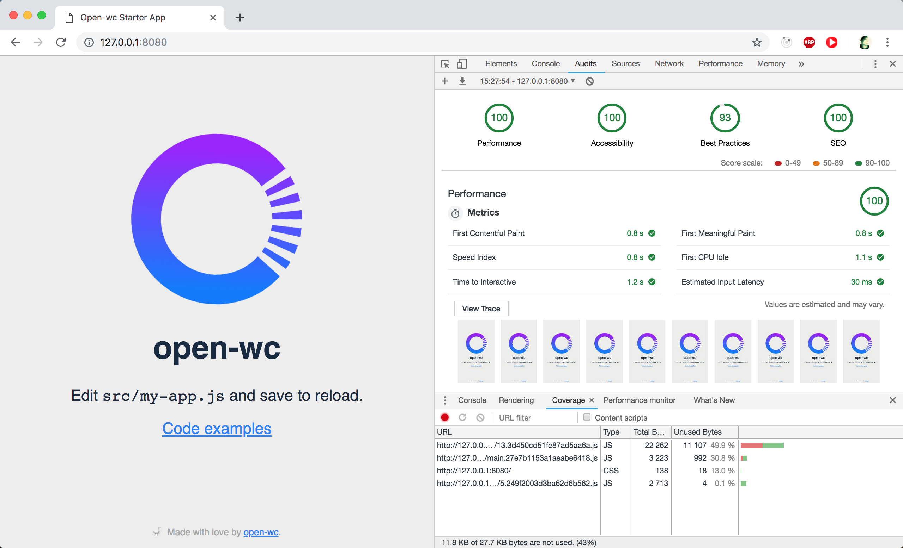

<p align="center">
  </img>
</p>

## Open-wc Starter App

[](https://github.com/open-wc)

## Quickstart

To get started:

```sh
npm init @open-wc starter-app
# requires node 10 & npm 6 or higher
```

<p align="center">
  </img>
</p>

## Scripts
- `build` builds your app and outputs it in your dist directory
- `start:build` runs your built app from dist directory
- `watch:build` builds and runs your app, rebuilding when input files change
- `test` runs your test suite with Karma
- `lint` runs the linter for your project
