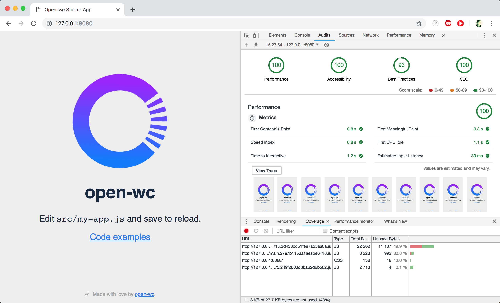

<p align="center">
  </img>
</p>

## Open-wc Starter App

[](https://github.com/open-wc) 

## Quickstart

To get started:

```sh
# in a new folder:
npm init yo open-wc
# requires npm 6 or higher

npm run start
```

<p align="center">
  </img>
</p>

## Scripts

- `start` runs your app (`./index.html`), with a minimal express server directly from source (only works in modern browsers)
- `start:dev` runs your app (`./src/index.html`) with auto reload for development with webpack, it only works on browsers which support modules for faster builds
- `start:dev:es5` runs your app for development, it only works on browsers that don't support modules (IE11)
- `build` builds your app for production and outputs it in the /dist folder
- `start:build` runs your built app using a plain web server, to prove it works without magic 😃
- `build:stats` creates an analysis report of your app bundle to be consumed by Webpack Visualizer and Analyser
- `test` runs your test suite with Karma
- `lint` runs the linter for your project
